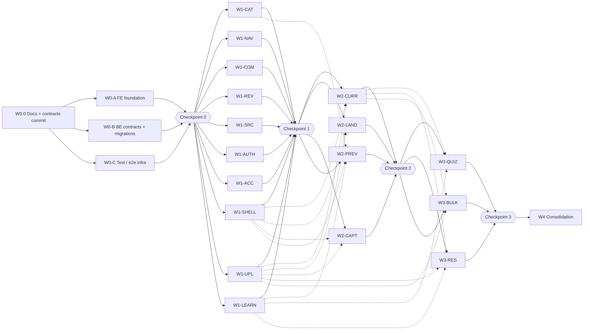

# LearnStream — UI Requirements Implementation Plan (Waves & Parallel Lanes)

Date: 2026-09-14 (restructured 2026-09-15)
Source specs:
- `UI_REQS_14_09_26.md`: Homepage & Navigation; Signup & Profile Suite; Enrollment/learning flow; Rating & Review System; Search & Filtering System
- `UI_REQS_14_09_26_course_creationflow.md`: teacher course authoring gap analysis

Companion docs: `REQUIREMENTS.md` · `UI_AUDIT.md` · `BACKEND_AUDIT.md` · `AI_INTEGRATION_STRATEGY.md`

**Scope.** Full-stack. The work is organised as **dependency waves**. Each wave holds **lanes**: a lane is a feature one subagent owns end to end (backend, tests, frontend, e2e) in its own git worktree. Lanes in the same wave don't depend on each other and don't edit the same files. The execution rules are in §10.

**Paths** are relative to `LearnStream/` unless stated otherwise.

**Requirement ID prefixes.** Every source spec reuses numbers like FR-1.1, so this plan prefixes them:

| Prefix | Source |
|---|---|
| **H-** | Homepage & Navigation spec, e.g. `H-FR-2.1` |
| **S-** | Signup & Profile Suite spec, e.g. `S-FR-1.2` |
| **L-** | Enrollment/learning flow "Functional Requirements for Parity" Modules 1–4, e.g. `L-FR-3.1` |
| **C-** | Course creation doc: `C-FR-1`…`C-FR-22`, `C-UI-1`…`C-UI-14` (its "UI Gap" sections), `C-NFR-1`…`C-NFR-10` |
| `FR-REV-*`, `FR-SRC-*` | Already unique; used as written |

**Deferred on purpose.** These are listed in [Deferred](#deferred) with what each needs:
- All OAuth
- MFA and active sessions
- Notifications and messages
- Saved payment methods
- Course review submission and moderation (C-FR-19, FR-REV-4.1)
- Promotions, coupons and course messages (C-FR-12, C-FR-13)

**Rule-based for now.** The AI Overview and related searches (FR-SRC-2.2, FR-SRC-4.1) are driven by rules until an LLM or vector version replaces them.

---

## Contents

0. [Corrections to the source specs](#0-corrections-to-the-source-specs-read-first)
1. [Target architecture](#1-target-architecture)
2. [State management](#2-state-management)
3. [Design decisions D1–D11](#3-design-decisions-d1d11)
4. [Waves and lanes](#4-waves-and-lanes) (plus [Deferred](#deferred))
5. [Component contracts: Navbar and Course Popover](#5-component-contracts-navbar-and-course-popover)
6. [Search, filtering and taxonomy](#6-search-filtering-and-taxonomy)
7. [Performance](#7-performance)
8. [Existing code to reuse](#8-existing-code-to-reuse)
9. [Risks and open issues](#9-risks-and-open-issues)
10. [Subagent execution protocol](#10-subagent-execution-protocol)
11. [Requirement traceability](#11-requirement-traceability)

---

## 0. Corrections to the source specs (read first)

### 0.1 The "backend is already implemented" claim is false

The Homepage spec's *Stack & Environment* says: *"Unauthenticated public course endpoints, decoupled guest access, separated first/last name fields, and OTP endpoints are already implemented and pushed."*

This was checked on 2026-09-14 and **none of it exists on any branch**:
- Searched every local, `origin/*` and `secondary/*` branch for `otp|firstName|lastName|nodemailer|passport` across `backend/src` and `backend/package.json`: 0 files.
- `backend/src/routes/CourseRoutes/modules.routes.js:12` puts `verifyAuth` on `GET /:course_id/modules`, and `lectures.routes.js:17` does the same on the lecture list. Guests get **401** on the curriculum.
- `backend/src/models/user.model.js:24` has a single `name` field. Signup logs the user in immediately.
- No optional-auth middleware, email transport, search, reviews, stats, or profile/avatar/password endpoints.

Every lane below therefore includes its backend work.

### 0.2 Route collision: `/user/:id`

The course page currently lives at `user/:course_id` (`frontend/src/main.jsx`), but S-FR-3.3 wants `/user/[username-slug]/`.

**Resolution:**
- The course page moves to **`/course/:courseId`**.
- `LegacyUserRoute` on `/user/:param` redirects a 24-character hex `param` to `/course/:param`; anything else renders the public profile.
- `backend/src/utils/slug.js` rejects 24-character hex usernames.

The search page uses the plural **`/courses/search`** (FR-SRC-2.1), so it can never collide with the singular course route.

### 0.3 A public curriculum deliberately reverses a B1 decision

`backend/tests/regressions/1.1-course-modules-access.test.js` changes on purpose: a guest now gets 200. The property that still holds, and is tested: **guests and non-entitled viewers never receive media ids or playable URLs.** Record the reversal in `BACKEND_AUDIT.md` §1.1.

### 0.4 "Teach on LearnStream" can't be a role switch yet

A user has a single `role` enum, `ROLES = { STUDENT, TEACHER }` (`user.model.js:7`), and emails are unique across roles. The link therefore goes to a `/teach` info page, or "Instructor dashboard" for teachers. Multi-role accounts and an admin role are deferred.

### 0.5 e2e tests tied to current behaviour

| Coupling | Where | Handled by |
|---|---|---|
| Reads `localStorage.userMeta` | `e2e/tests/auth-token-refresh.spec.ts:28`, `course-list-navigation.spec.ts` | AUTH keeps it working; W4 removes it |
| Visits `/user/${courseId}` | `course-detail-view.spec.ts:11,38,52`, `lecture-completion.spec.ts` | CAT (route), LEARN (spec rewrite) |
| Category selector `.no-scrollbar button`; `getallCourses` URL assertions | `course-list-navigation.spec.ts` | CAT |
| Signs up through the API; seeds course/module/lectures through the current endpoints | `e2e/lib/api-client.ts:67-134`, `e2e/global-setup.ts:103-151` | W0-B adapters keep the endpoints working; W0-C makes the helpers OTP-ready; W4 moves the seed to the instructor API |
| Two tests fail on purpose (completion POST fires twice) | `lecture-completion.spec.ts` | LEARN rewrites the spec: the tests are replaced, not loosened |

### 0.6 Lecture `duration` is in seconds, but shown as "mins"

`backend/src/services/lecture.service.js:18,51` stores Cloudinary's `video.duration`, which is in seconds. `frontend/src/Pages/ViewStudentModule.jsx:42` and `Pages/ViewtheModules.jsx:91` label it "mins". All new durations are `durationSec`, formatted by `lib/format.js`.

### 0.7 The course-creation doc's `.tsx` / `.ts` examples

The frontend is JavaScript (JSX + `jsconfig.json`). Use `.jsx` / `.js`, JSDoc typedefs, and zod schemas in place of its `types/` folder. No TypeScript migration is planned.

### 0.8 `isLive` is written but never read

It's set at creation (`services/course.service.js:9,34`, `Pages/MakeaCourse.jsx:55`), but no listing or `GET /courses/:id` filters on it, so every course is public today. D2 replaces it with `status`.

### 0.9 Lecture video replace can't be reached

`PUT` on a lecture (`lectures.routes.js:22`) has no multer middleware, so `req.file` is never set. `updateLectureDetails` also deletes the old video *before* uploading the new one, with no null check on the upload result.

### 0.10 JSON body limit is 16 kb

`backend/src/app.js:44` (and `urlencoded` at `:65`). That blocks autosave and full-curriculum payloads. W0-B adds a 1 mb parser scoped to `/instructor`.

### 0.11 The student player

`Pages/LectureAssig.jsx`:
- Hardcodes the Cloudinary cloud name (`:11`, `"dc9lboron"`) and ignores the stored `videourl`.
- Reads lecture data only from `location.state`, so a refresh or deep link shows an empty page.
- Marks a lecture complete as soon as it's selected. Because the checkbox sits inside a `<label>` inside a clickable card, that fires two POSTs.

### 0.12 Free courses can't be enrolled in

- There is no enroll route: `components/EnrollButton.jsx` posts to a route that doesn't exist.
- `controllers/Payment.controller.js` `createOrder` sends a price of 0 to Razorpay, which rejects anything under 100 paise.
- Price-0 courses can still be created.

### 0.13 Smaller data-integrity gaps

- `lecture.course_id` is never written.
- `GET /courses/:courseId/progress` has no role or enrollment guard.
- `/complete` doesn't verify that the lecture belongs to the course.
- Assignments are never pushed to `course.assignments`.
- `assignment.checked` is never written; no grading exists.

### 0.14 Upload and uniqueness bugs

- The multer MIME allowlist has the invalid `video/mkv` and lacks `video/quicktime` and `video/webm`.
- Course titles are unique across **all** teachers (`course.service.js:18`).
- The thumbnail uploads before the course document is created, so a failed create leaves an orphan file.

### 0.15 Blockers for parallel execution (all verified)

- e2e ports are hardcoded (`e2e/playwright.config.ts:3-4`: 2000/8000).
- `backend/.env`, `frontend/.env` and `e2e/.env.e2e` are git-ignored, so new worktrees don't get them.
- `frontend/package.json` has no `build` script (only `dev`, `lint`, `preview`).
- The planning docs were untracked until the docs commit.

### 0.16 Spec translations

- The Review schema's `UUID` fields and snake_case names map to MongoDB ObjectIds and camelCase API fields.
- "AI Overview" and "query vectors" are rule-based for now (§6.4). The **"AI Overview"** title is kept as the spec states.

---

## 1. Target architecture

### 1.1 Frontend (`frontend/src`)

```
main.jsx                       # createRoot + <AppProviders><RouterProvider/></AppProviders>; keeps the vite:preloadError reload
app/
  router.jsx                   # collects features/*/routes.jsx via import.meta.glob (registry — lanes add files, never lines)
  menuRegistry.js              # collects features/*/menu.js for the user menu
  providers.jsx                # QueryClientProvider → AuthProvider → CartProvider → TooltipProvider + <Toaster/>
  layouts/RootLayout.jsx       # SiteHeader, <Outlet/> in Suspense + ErrorBoundary, SiteFooter
  guards/RequireAuth.jsx  guards/RequireRole.jsx
  RouteError.jsx
components/
  ui/                          # shadcn CLI output only (pinned shadcn@2.10.0)
  common/                      # EmptyState, ErrorState, ComingSoon, RatingStars (half-star), Price, CourseThumb, Skeletons
  media/VideoPlayer.jsx        # native <video> + lazily imported hls.js
  layout/SiteHeader/  layout/SiteFooter.jsx
features/
  auth/            onboarding/      account/       profile/       wishlist/
  catalog/         course/          course-preview/
  search/          reviews/         commerce/      (cart + checkout + PurchaseCta)
  learn/           (player; renderers/* registry)   my-learning/
  instructor-course/
    steps/*/step.jsx               # registry: {id, group:'plan'|'create'|'publish', label, path, order, lazy, readinessKeys}
    content-types/*/index.jsx      # registry: {type, label, icon, Editor, createDefaults, available}
    item-editor-panels/*           # registry
    components/ (CourseAuthoringLayout, Header, Sidebar, SaveStatus, UnsavedChangesDialog, AuthoringError, AuthoringSkeleton)
    stores/authoringStore.js       # zustand, one store per course
  uploads/                     # upload queue store, chunked uploader, MediaUploadField, ImageUploadField, UploadTray
  nav/  teach/
  (each feature: routes.jsx, menu.js?, api.js, queryKeys.js, components/, pages/, index.js)
lib/
  api/{publicClient, privateClient, tokenStore, errors}.js
  queryClient.js  storage.js  utils.js (cn)  money.js  format.js  relativeTime.js  reportError.js
hooks/  useDebouncedValue.js  useMediaQuery.js  useHoverIntent.js
```

**Rules:**
- A feature imports only from `components/`, `lib/`, `hooks/` and other features' `index.js`. Enforce this with ESLint `no-restricted-imports`.
- Use the `@/` alias.

**Mapping from the course-creation doc §29.** Its `features/instructor-course/` layout is adopted with three changes:
- `pages/` becomes `steps/` (registry).
- `types/` becomes JSDoc + zod.
- Upload components move to the shared `features/uploads/`, because captions, resources, thumbnails and promo videos also use them.

### 1.2 Backend (`backend/src`)

| Layer | Additions |
|---|---|
| `routes/` | `routes/features/*.routes.js`, auto-mounted from `{basePath, priority, router}`; static paths mount before the legacy `/courses/:courseId`. `routes/test/*.routes.js`, mounted only when `E2E_TEST_ROUTES=1` and not in production. |
| `models/` | `section` (bound to the existing `modules` collection), `curriculumItem` (+ discriminators), `schemas/{media, resource}.schema.js`, progress v2, `watchPosition`, `review`, `reviewVote`, `searchQuery`, `searchEvent`, `uploadSession`, `quiz`, `quizAttempt`, `pendingRegistration` |
| `config/` | `taxonomy.js` (categories → subcategories → topics), `languages.js`, `courseLifecycle.js`, `search.js`, `uploadPolicy.js`, `pricing.js` |
| `services/` | `media/{index, providers/cloudinary, providers/fake}`, `stats/curriculumStats.js`, `entitlement.service.js`, `catalog/`, `search/{engine, engine.mongo, spotlight, related, trending}`, `reviews/`, `learn/`, `instructor/`, `readiness/{index, rules/*.rule.js}`, `captions/`, `otp`, `mail`, `registration`, `user/` |
| `middleware/` | `optionalAuth` (in `auth.js`), `validateQuery`, `cacheControl` |
| `utils/dto/` | `courseCard.js`, `coursePublic.js`, `curriculum.js`; `utils/cloudinaryUrl.js`, `utils/slug.js` |
| `scripts/` | `migrate-w0-curriculum-v2.js`, `migrate-w0-course-status-metadata.js`, `migrate-w0-users-split-names.js`, `backfill-w0-course-stats.js`, `seed-demo-reviews.js` |
| `tests/` | `tests/features/**`, `tests/factories/core.js`, on the existing Vitest + Supertest + mongodb-memory-server harness |

---

## 2. State management

| State | Owner | Lives in |
|---|---|---|
| Server data | TanStack Query v5 | In-memory cache; public subset persisted to localStorage |
| Auth | `AuthProvider` | Access token in memory; refresh token in an httpOnly cookie |
| Guest cart | `CartProvider` → `guestCartStore` | localStorage |
| Authoring UI | zustand store per course | Memory |
| Upload queue | zustand singleton | Memory, plus a localStorage resume fingerprint |
| Search filters | URL query parameters | URL |

### 2.1 Server data: TanStack Query v5

- **Category switching under 200 ms (H-NFR-1.1):** `['catalog', {category, subcategory, page}]`, `staleTime: 5 min`, prefetch on tab hover/focus, `placeholderData: keepPreviousData`.
- **Cold starts (H-NFR-1.3):** skeletons, plus `@tanstack/query-sync-storage-persister` for `catalog`, `categories`, `stats` and `featuredReviews` only (24 h, build-id buster).
- **Errors (H-NFR-3.1):** a global `QueryCache.onError` shows a sonner toast via `normalizeApiError`; components render `ErrorState` with Retry.
- **Keys:** each feature owns its keys in `features/<f>/queryKeys.js`, so lanes never share one keys file.

### 2.2 Auth

- **Non-blocking bootstrap.** Today `contexts/AuthProvider.jsx` blocks the whole app with "Loading...". It becomes `status: 'unknown' | 'authenticated' | 'guest'`, and public pages render immediately.
- **`publicClient`:** no credentials, no interceptors. A public call can never trigger a refresh or a 401 (H-FR-3.2).
- **`privateClient`:** injects the Bearer token from `tokenStore`, and the refresh interceptor uses one shared refresh promise.
- **S-NFR-1.2:**
  - The access token stays in memory; `REQUIREMENTS.md` §6.4 explains why cross-site partitioned cookies can't be the primary auth path.
  - The refresh token lives only in the httpOnly cookie. JSON response bodies stop returning `refreshToken`.
  - No JWT ever goes into Web Storage. Pair this with a short access-token expiry and CSP.
- **Logout:** targeted cleanup instead of `localStorage.clear()` (`Navbar1.jsx:75`), so the guest cart survives.

### 2.3 Cart: `useCart()` facade

```
useCart() → { mode: 'guest'|'server'|'disabled', items, count, isLoading, has(id), add(courseCardDto), remove(id), canPurchase }
```

**Modes:**
- Guest → localStorage key `learnstream:guestCart:v1` (validated on read, max 50 items, cross-tab `storage` sync).
- Student → server query with optimistic mutations.
- Teacher → `disabled`.

**Merge on login:** an effect in `CartProvider` calls `POST /courses/cart/merge` (idempotent `$addToSet`; skips missing, enrolled or free courses) and clears the local key only on a 2xx response.

**Pricing:** guest prices are refreshed through `GET /courses/cards?ids=`. Checkout requires login.

### 2.4 Authoring (C-NFR-9)

- **Server data** (course, sections, items, uploads, publishing state) lives in TanStack Query.
- **Local UI state** lives in a zustand `createStore` created per course and provided through context: active step, selected item, expanded sections, drag state, dirty sources.
  - zustand selectors are used instead of `useReducer` context, because upload-progress ticks and drag state would re-render every context consumer.
- **Autosave:** each form group has its own react-hook-form instance, watched, debounced 1 s, sending a PATCH of dirty fields with `editVersion`.
  - States: idle → saving → saved → error (Retry) → conflict.
  - A 409 opens a dialog: "reload latest" or "overwrite".
- **Unsaved changes:** `useBlocker` + `beforeunload` while any dirty source or upload is active (C-FR-21).
- **Curriculum mutations** share a TanStack mutation `scope` per course, so they run serially.

### 2.5 Uploads

- A module-level zustand queue (concurrency 2) survives in-app navigation.
- Server-persisted `media.status` is polled every 5 s while `PROCESSING`.
- The `uploadId` + file fingerprint is stored in localStorage, so re-selecting the same file resumes the upload.

### 2.6 Learn

- `playbackRate` preference: localStorage.
- Watch position and completion: **server only**.
- Sidebar open/closed: local state.

### 2.7 Search (FR-SRC-3.2)

- **The URL is the single filter state.** `useSearchFilters()` parses `useSearchParams` with zod. Both the quick-filter bar and the All Filters panel read and write through it.
- Every change pushes a history entry, so Back/Forward restores the filter state, and refresh, bookmarks and shared links reproduce it.
- Results use `keepPreviousData`, so they update in place with no full reload.
- An anonymous `searchSessionId` (uuid, rotated after 30 min idle) is stored in localStorage for the query log.

### 2.8 Reviews

- Votes are optimistic with rollback.
- A guest action opens `LoginPromptDialog` via `useRequireAuth()`, then resumes after login.

---

## 3. Design decisions D1–D11

### D1 — Curriculum model (the shared contract)

**Sections**
- The `Sections` model is bound to the existing collection: `mongoose.model('Sections', schema, 'modules')`.
- Fields: `{course, title ≤80, learningObjective ≤200, description, order:int}`. Index `{course:1, order:1}`.
- `module.model.js` becomes a re-export shim until W4.
- The API and UI say **"section"** everywhere (C-UI-4).

**CurriculumItems**
- One new collection, with Mongoose discriminators on `type`.
- **Base fields:** `{course, section, type, title ≤80, description, order:int, isFreePreview, durationSec, resources:[ResourceSchema], editVersion}`.
- **Discriminators:**
  - `video`: `{media: MediaSchema}`
  - `article`: `{body: markdown ≤50k, readingTimeSec}`
  - `assignment`: `{assignment: ref Assignments}`. The existing collection and its submissions stay.
  - `quiz`: `{quiz: ref Quizzes, quizKind: 'quiz'|'practice_test'}`
  - `resource`: `{file: ResourceSchema}`
  - `video-slides`: schema reserved (Deferred)
- **Indexes:** `{section:1, order:1}` and `{course:1, type:1}`.

**Ordering (C-NFR-4)**
- Every section and item has an explicit, dense `order`.
- Reorder and move-between-sections is **one full-tree PUT** guarded by `course.curriculumVersion` (compare-and-increment), applied with `bulkWrite`.
- Re-applying the same payload gives the same result. That fits the existing no-transaction design in `services/bulk-module.service.js`.

**`MediaSchema`** (`models/schemas/media.schema.js`)

| Group | Fields |
|---|---|
| Source | `provider: 'cloudinary'\|'fake'`, `publicId` |
| Status | `status: NONE\|UPLOADING\|PROCESSING\|READY\|FAILED`, `statusChangedAt`, `error{code, message}` |
| File metadata | `durationSec`, `bytes`, `width`, `height` |
| Delivery | `mp4Url`, `hlsUrl`, `posterUrl` |
| Captions | `captions: [{_id, lang, label, url, publicId, isDefault}]`, `transcriptText` |

**Migration: `scripts/migrate-w0-curriculum-v2.js`**
- Idempotent, with `--dry-run` and a marker document.
- Order is taken from the array positions in `course.modules[]` and `module.lectures[]`.
- Each lecture becomes a `video` item; each assignment becomes an `assignment` item, appended after the lectures.
- **Original `_id`s are preserved**, so `Progress.completedLectures.lectureId` and the e2e fixture ids stay valid.

**Legacy endpoints**
- `/modules`, `/lectures`, `/modules/bulk` and `/assignments` are reimplemented as **adapters** over the new model, with the same response shapes.
- The old pages and `e2e/global-setup.ts` keep working until the lanes that replace them. W4 deletes the adapters.

### D2 — Course lifecycle (C-FR-17)

- `status` enum: `DRAFT | READY_FOR_REVIEW | UNDER_REVIEW | PUBLISHED | ARCHIVED`. `config/courseLifecycle.js` allows only `DRAFT ↔ PUBLISHED` for now; the other values are reserved for deferred review and moderation.
- **Migration:** existing courses become `PUBLISHED` (`publishedAt = createdAt`). New courses start as `DRAFT`.
- `visibleCourseFilter(viewer)`:
  - Public catalog, search and course page show `PUBLISHED` only.
  - The owner sees drafts.
  - Enrolled students keep access after an unpublish.

### D3 — Course metadata (one schema change, in Wave 0)

**Fields:**
- **Landing page:** `title ≤60`, `subtitle ≤120`, `description`, `thumbnail`, `thumbnailPublicId`, `thumbnailAlt`, `promoVideo: MediaSchema`
- **Classification:** `category`, `subcategory`, `topics[≤10 slugs]`, `level: beginner|intermediate|advanced|all`, `language` (BCP-47), `isCertificationPrep`
- **Learner info:** `learningObjectives[≤10×160]`, `requirements[≤10]`, `noPrerequisites`, `targetAudience[≤10]`
- **Pricing:** `price` (paise; 0 = free), `currency: 'INR'`, `pricingConfirmedAt`
- **Lifecycle and search:** `status`, `publishedAt`, `editVersion`, `curriculumVersion`, `searchText` (normalized, denormalized)
- **`stats`:** `{totalDurationSec, lectureCount, articleCount, quizCount, resourceCount, captionLanguages[], practiceTypes[], ratingAvg, ratingCount, ratingDistribution{1..5}, enrollmentCount}`

**Rules:**
- Each stats writer `$set`s only its own dotted paths.
- **`editVersion` is bumped only by authoring writes**, so stats and enrollment writes never cause spurious 409 autosave conflicts (C-NFR-5). Don't use `__v` for this.
- Course title uniqueness becomes **per author**.
- **Indexes:** `{status, publishedAt}`, `{status, category, subcategory}`, `{status, 'stats.ratingAvg'}`, `{author, status}`.

### D4 — Upload pipeline (C-FR-6, C-NFR-2, C-NFR-3)

Browser → Cloudinary directly. This replaces the multer temp-file path, where client progress only measures browser → our server.

1. **`POST /instructor/uploads/sign`** issues signed params: `public_id`, `eager: sp_auto/m3u8`, `eager_async`, `eager_notification_url`.
2. **Chunked upload.** The browser sends 20 MB chunks with `X-Unique-Upload-Id` + `Content-Range`, retrying each chunk 3× with backoff.
3. **`POST …/complete`.** The server verifies the asset through the Admin API (it never trusts the client), writes the target, and sets `PROCESSING` or `READY`.
4. **Processing finishes.** A signature-verified, idempotent webhook sets `READY` with `hlsUrl`. A lazy reconcile poll covers localhost and missed webhooks.
5. **Replace.** The old asset is deleted **only after the new one is READY**.
6. **Tests and e2e** use `MEDIA_PROVIDER=fake`.

`media.status` is persisted on the item, so it survives a refresh.

### D5 — Player and progress (L-FR-3, L-FR-4)

- **Player:** native `<video>` plus `hls.js`, dynamically imported only where native HLS isn't available. The speed menu, captions menu and transcript panel live outside the video element; the transcript is parsed from VTT with no extra dependency.
- **Watch tracking:** a heartbeat every 15 s (and on pause, ended and `visibilitychange`) writes a `watchpositions` record.
  - The server caps the watched delta at elapsed wall time × playback rate.
  - An item auto-completes at `watchedSec ≥ 0.9 × durationSec` (L-FR-4.1).
- **Progress v2:** `completedItems[]` (migrated), `lastItemId`, `lastAccessedAt`, `percentComplete`, `completedAt`. Countable types are `video`, `article`, `quiz` and `assignment`.
- **The course owner, when previewing, never writes progress.**

### D6 — Search stays on MongoDB (regex + `$facet`), not Atlas Search

- **Why not Atlas Search:** `mongodb-memory-server` (backend tests and the e2e harness) and local dev **cannot run `$search`**. The catalog is demo-scale, and 1-character suggestions don't need analyzers.
- **Swappable:** everything sits behind `services/search/engine.js`. `engine.mongo.js` is today's implementation; `engine.atlas.js` or a vector engine (`AI_INTEGRATION_STRATEGY.md` §2.1) can swap in with the same response contract.
- **Ceiling:** about 1,000 candidates per query. Beyond that, move to Atlas.

### D7 — Reviews (FR-REV)

- **Rating:** 1.0–5.0 in **0.5 steps**, validated by `Number.isInteger(v * 2)`.
- **Distribution:** bucket = `floor(rating)`. Percentages use the largest-remainder method so they sum to 100.
- **Votes:** `reviewvotes` with a unique `(review, user)` index.
  - The endpoint **sets** a state (`HELPFUL | UNHELPFUL | NONE`); the client computes the toggle (FR-REV-3.2).
  - After each write, counts are recounted with `countDocuments`.
  - Voting on your own review is not allowed.

### D8 — Routes

**Frontend:**

| Route | Page |
|---|---|
| `/course/:courseId` | Course page |
| `/courses/search` (trailing slash accepted; `/search` redirects) | Search |
| `/learn/:courseId`, `/learn/:courseId/items/:itemId` | Player |
| `/my-learning` | Student dashboard |
| `/instructor/courses`, `/instructor/courses/new`, `/instructor/courses/:courseId/{plan,content,publish,review}/…` | Authoring |
| `/user/:username` | Public profile |
| `/account/*` | Account suite |

**Backend:** static paths (`/courses/search`, `/courses/catalog`, `/courses/cards`, `/courses/categories`) mount before the legacy `/courses/:courseId` catch-all.

### D9 — Authoring UI state: zustand

See §2.4.

### D10 — Free enrollment (L-FR-2)

- `POST /courses/:courseId/enroll`: student only, **PUBLISHED and price 0**, idempotent. Paid courses get `402 PAYMENT_REQUIRED`. Returns `{redirectTo: '/learn/:courseId'}`.
- `createOrder` rejects free, unpublished or already-enrolled courses (`400 FREE_COURSE_ENROLL_DIRECTLY`).
- `addToCart` rejects free courses.

### D11 — How parallel lanes avoid touching each other

1. **Glob registries: lanes add files, never edit shared lines.**

   | Registry | Location |
   |---|---|
   | Frontend routes | `features/*/routes.jsx` |
   | User menu | `features/*/menu.js` |
   | Authoring steps | `instructor-course/steps/*` |
   | Content types | `instructor-course/content-types/*` |
   | Item editor panels | `instructor-course/item-editor-panels/*` |
   | Player renderers | `learn/renderers/*` |
   | Backend routes | `routes/features/*.routes.js` |
   | Readiness rules | `services/readiness/rules/*.rule.js` |
   | e2e seeds | `e2e/seeds/*.seed.ts` |

2. **Frozen stubs.** Wave 0 creates cross-lane components with fixed signatures; the owning lane replaces only the body.

   | Stub | Owner |
   |---|---|
   | `PurchaseCta({course, variant})`, `CartButton`, `useCart` | COM |
   | `CourseRatingHeaderMetric({courseId, stats})`, `CourseReviewsSection({courseId})`, `HomeSocialProof` | REV |
   | `GlobalSearch({variant})` | SRC |
   | `WishlistButton`, `PublicProfilePage` | ACC |
   | `PreviewBanner` | PREV |
   | `CourseCard`, `CourseGrid` | CAT |

3. **Ownership manifests.** `docs/lanes/<lane>.json` holds `{owns: [globs], appends: [globs]}`, and `e2e/scripts/check-lane-ownership.mjs` enforces them.

---

## 4. Waves and lanes



**Reading the graph.** Solid arrows are wave gates. Dashed arrows are the real lane-to-lane dependencies that decide which wave a lane belongs in. **Every lane in a wave runs in parallel with every other lane in that wave.**

**Summary:**

| Wave | Lanes (parallel) | Gate |
|---|---|---|
| 0 | W0.0 first, then W0-A, W0-B, W0-C | Checkpoint 0 |
| 1 | CAT, NAV, COM, REV, SRC, AUTH, ACC, SHELL, UPL, LEARN | Checkpoint 1 |
| 2 | CURR, LAND, CAPT, PREV | Checkpoint 2 |
| 3 | QUIZ, RES, BULK | Checkpoint 3 |
| 4 | Consolidation (single lane) | — |

If orchestration capacity is limited, Wave 1 can run as W1a {UPL, CAT, REV, LEARN, SHELL} then W1b {SRC, COM, NAV, AUTH, ACC}. That split is a capacity choice, not a dependency.

---

### Wave 0 — contracts and foundation

#### W0.0 Docs + contracts commit (integrator, sequential, first)

- [ ] Commit the planning docs, so worktrees can see them.
- [ ] Add `docs/contracts/`:
  - `domain-model.md` (D1–D3)
  - `api-conventions.md`: camelCase, ObjectIds, errors `{message, errors:[{field, code}]}`, 409 `{code: 'VERSION_CONFLICT', current}`
  - `dto.md`
  - `registries.md`
  - `stubs.md`
- [ ] Add `docs/lanes/<lane>.json` ownership manifests for every lane below.

#### W0-A Frontend foundation

- **Requirements:** H-FR-3.2 (clients), H-NFR-1.3, H-NFR-3.1, S-NFR-1.2 (frontend), C-NFR-10 (reporter).
- **Parallel with:** W0-B, W0-C.
- **Owns:**
  - `frontend/package.json` + lockfile, `tailwind.config.js`, `components.json`, `vite.config.js`, `vitest.config.js`
  - `src/main.jsx`, `src/app/**`, `src/lib/**`, `src/hooks/**`
  - `src/components/{ui,common,media}/**`, `src/components/layout/SiteHeader/index.jsx` (stub)
  - All stub `features/*/index.js`, `features/auth/{LoginPromptDialog,useRequireAuth}.jsx`
  - `e2e/tests/app-shell.spec.ts`

**Tasks:**
- [ ] **Dependency batch.** This is the only lockfile change until an amendment:
  - `@tanstack/react-query`, `@tanstack/react-query-persist-client`, `@tanstack/query-sync-storage-persister`
  - `react-hook-form`, `@hookform/resolvers`, `zod`
  - `zustand`
  - `@dnd-kit/core`, `@dnd-kit/sortable`, `@dnd-kit/utilities`
  - `hls.js`
  - `react-markdown`, `remark-gfm`
  - Dev: `vitest`, `@testing-library/react`, `@testing-library/user-event`, `@testing-library/jest-dom`, `jsdom`, `rollup-plugin-visualizer`, `@lhci/cli`
  - No date library: `lib/relativeTime.js` uses `Intl.RelativeTimeFormat`.
- [ ] **shadcn batch, in one run:**
  ```
  npx shadcn@2.10.0 add popover command navigation-menu sheet skeleton tabs form label separator scroll-area carousel input-otp sonner tooltip accordion aspect-ratio checkbox radio-group switch select textarea progress collapsible alert alert-dialog card table pagination toggle breadcrumb
  ```
  Then verify `tailwind.config.js` still uses `var(--x)` and not `hsl(var(--x))` (`REQUIREMENTS.md` §12.1).
- [ ] **Scripts:** add `"build": "vite build"` and `"test": "vitest run"`.
- [ ] **App shell:** glob router (legacy paths unchanged), menu registry, providers, API clients + `tokenStore`, non-blocking `AuthProvider`, `LegacyUserRoute`, `RouteError`, `RequireAuth`, `RequireRole`.
- [ ] **Shared components and libs:**
  - `common/*`
  - `lib/format.js`: hours, `h m`, compact numbers
  - `lib/relativeTime.js`
  - `lib/reportError.js`: `{courseId, sectionId, itemId, operation, timestamp, errorCode}`, never raw stack traces (C-NFR-10)
- [ ] **`components/media/VideoPlayer.jsx`** with props `{src:{hlsUrl, mp4Url}, poster, tracks[], playbackRate, startAt, onTimeUpdate, onEnded, onPlay, onPause, onRateChange, videoRef}`.
- [ ] **Stubs:** every component in D11, with frozen signatures and placeholder bodies.
- [ ] **Cleanup:** delete the dead files (`App.jsx`, `Pages/LoginCommon.jsx`, `Pages/Login-students.jsx`, `Pages/Login-teacher.jsx`, `components/login-form.jsx`). Replace the `alert()` in `ViewStudentModule.jsx`. Fix `Home.jsx` not passing `setErrMsg` to `GeneralCourses`.

**Tests:**
- [ ] `app-shell.spec.ts`: the page renders while refresh is pending; no Authorization header on public calls.
- [ ] Vitest for `format` and `relativeTime`.

**Done when:**
- [ ] `npm run build` passes.
- [ ] The existing e2e baseline holds: 13 pass, 2 intentional failures.

#### W0-B Backend contracts, migrations, adapters

- **Requirements:** C-FR-4, C-FR-17, C-NFR-4, C-NFR-5 (model), C-UI-4 (API naming), H-FR-3.1, H-FR-3.2, H-NFR-1.2, S-FR-1.3 (schema), S-FR-4.2 (summary), L-FR-1.2 (entitlement).
- **Parallel with:** W0-A, W0-C.
- **Owns:**
  - `backend/package.json` + lockfile, `src/app.js`
  - `src/config/**`, `src/models/**`, `src/middleware/**`, `src/utils/**`
  - Existing `src/services/**` and `src/routes/**`, plus `routes/loadFeatureRoutes.js`
  - `scripts/migrate-w0-*`, `scripts/backfill-w0-*`
  - `tests/factories/core.js`, `tests/regressions/**`

**Tasks:**
- [ ] **Dependencies:** `compression`, and `nodemailer` batched now for AUTH.
- [ ] **`app.js`:**
  - Add `compression`.
  - Raw-body verification for `/payment/webhook` and `/webhooks/cloudinary`.
  - `app.use('/instructor', express.json({limit: '1mb'}))` **before** the global 16 kb parser.
  - `await mountFeatureRoutes(app)`, sorted by priority.
  - Test routes only when `E2E_TEST_ROUTES=1 && !isProduction`.
- [ ] **`config/env.js`:** add every future key now: `MEDIA_PROVIDER`, `CLOUDINARY_NOTIFICATION_URL`, `CLOUDINARY_UPLOAD_FOLDER`, `SMTP_URL`, `OTP_SECRET`, `E2E_MAIL_OUTBOX`, `E2E_TEST_ROUTES`.
- [ ] **Config:** `taxonomy.js` (with topics), `languages.js`, `courseLifecycle.js`.
- [ ] **Models:**
  - D1–D3: course, section, curriculumItem + discriminators, media/resource schemas, progress v2.
  - **All** `user.model.js` additions, so no later lane edits it: `firstName`, `lastName`, `username` (sparse unique, never 24-hex), `emailVerifiedAt`, `avatar`, `avatarPublicId`, `headline`, `bio`, `links`, `language`, `phone`, `phoneVerifiedAt`, `interests[]`, `onboarding{}`, `privacy{showCourses}`, `wishlist[]`.
  - `name` stays, derived in pre-save.
- [ ] **Migrations:** `migrate-w0-curriculum-v2`, `migrate-w0-course-status-metadata` (includes taxonomy slugs), `migrate-w0-users-split-names`, `backfill-w0-course-stats`.
- [ ] **Services:**
  - `stats/curriculumStats.js`: `recomputeCurriculumStats(courseId)` computes duration, counts, `captionLanguages` and `practiceTypes`.
  - `entitlement.service.js`: `getViewerAccess`, `canPlayItem`.
  - `media/{index, providers/cloudinary, providers/fake}.js` (legacy server-side upload).
  - `utils/dto/{courseCard, coursePublic, curriculum}.js`, `utils/cloudinaryUrl.js`.
- [ ] **Legacy services rewritten on the new model, with the same response shapes:**
  - `module`, `lecture` (now writes the course and verifies membership), `bulk-module`, `assignment`.
  - `enrollment.service`: `updateOne` with an `enrolledStudents: {$ne}` filter + `$inc stats.enrollmentCount`.
  - `course.service`: visibility filter, per-author title uniqueness.
  - Legacy completion and `/progress`: guarded, percent over countable items.
- [ ] **Middleware:** `optionalAuth` (no token → guest; invalid token → 401, so refresh still works), `validateQuery`, `cacheControl`.
- [ ] **New endpoints:**

  | Endpoint | Notes |
  |---|---|
  | `GET /courses/categories` | |
  | `GET /courses/cards?ids=` | Batch `CourseCardDTO` |
  | `GET /courses/:courseId/curriculum` | `optionalAuth`, viewer-aware, **never** media URLs |
  | `GET /courses/:courseId/items/:itemId/playback` | Entitled viewer, or a free preview in a published course; otherwise 403 |
  | `GET /users/me/summary` | `{enrolledCount, enrolledCourseIds, cartCount, avatar}` |

- [ ] Stop returning `refreshToken` in JSON bodies. Stop returning `enrolledStudents` from `getCourseById`.

**`CourseCardDTO` (frozen):**
```
{ id, title, subtitle, thumbnailUrl, thumbnailSrcSet, author:{id, name, username},
  priceInPaise, isFree, currency, category, subcategory, level, language,
  rating:{avg, count}, enrollmentCount, badge:'bestseller'|'highest_rated'|'new'|null,
  totalDurationSec, lectureCount, hasCaptions, updatedAt, publishedAt, objectives[≤3] }
```

**Tests:**
- [ ] Migration keeps `_id`s and order, and is idempotent.
- [ ] A guest gets the curriculum (200) with no `publicId`/URLs; rewrite of regression 1.1.
- [ ] Playback: non-entitled viewer gets 403; free preview gets 200.
- [ ] Drafts are hidden from guests and visible to the owner.
- [ ] Stats writes don't bump `editVersion`.
- [ ] The enrollment count doesn't double-increment.
- [ ] All existing regressions pass.

#### W0-C Test and e2e infrastructure

- **Parallel with:** W0-A, W0-B.
- **Owns:**
  - `e2e/**`: config, global-setup, `lib/**`, `seeds/`, `scripts/check-lane-ownership.mjs`
  - `backend/tests/setup.js`, `backend/tests/helpers.js`

**Tasks:**
- [ ] **Ports:** `E2E_BACKEND_PORT` / `E2E_FRONTEND_PORT` (defaults 8000/2000) replace the constants in `playwright.config.ts`.
  - Add `webServer` for vite with `--port --strictPort` and `VITE_BACKEND_URL`.
  - The backend gets `PORT` and `CORS_ORIGIN`.
  - **Required, otherwise parallel worktrees collide.**
- [ ] **Backend env for e2e:** start it with `E2E_MAIL_OUTBOX=1`, `E2E_TEST_ROUTES=1`, `MEDIA_PROVIDER=fake`.
- [ ] **Seed registry:** each `e2e/seeds/*.seed.ts` exports `seed(ctx)`, runs after the base seed, and writes `.auth/seeds/<name>.json`, read back with `readSeed(name)`.
  - Base seed: taxonomy slugs, one published paid course with 1 section and 2 video items, and a second course in another category.
- [ ] **OTP-ready signup:** `lib/api-client.ts` `signupStudent` / `signupTeacher` accept **201** (today) **and 202** (OTP → read outbox → verify), so AUTH needs no helper edits.
- [ ] **Selectors:** split `lib/selectors.ts` into `lib/selectors/{auth,course,learn}.ts` (re-exported). Lanes add helpers only in `lib/api/<lane>.ts`.
- [ ] **Ownership check:** `check-lane-ownership.mjs <lane>` diffs against the base branch using `docs/lanes/<lane>.json`.

#### Wave 0 handoff

**Frozen after W0** (integrator-only amendments): `app.js`, `config/env.js`, all W0 models, `utils/dto/*`, `app/router.jsx`, `providers.jsx`, stub signatures, `global-setup.ts`, `api-client.ts`, both lockfiles.

**Handed to exactly one lane:**

| Lane | Files it takes over |
|---|---|
| UPL | `services/media/**` |
| COM | `enrollment.service.js`, `payment.service.js`, `Payment.controller.js`, `cart.controller.js`, `Pages/Cart.jsx`, `Pages/displayRazorpay.js`, `components/{AddToCartBtn,EnrollButton}.jsx` |
| LEARN | Legacy completion controllers/routes, `Pages/{LectureAssig,StudentPage}.jsx`, `selectors/learn.ts`, `lecture-completion.spec.ts` |
| CAT | `course.service.js`, `Course.controller.js`, `courses.routes.js`, `Pages/{Home,ViewStudentModule}.jsx`, `components/{GeneralCourses,CategoryBar,CourseComp}.jsx`, `selectors/course.ts`, `course-detail-view.spec.ts`, `course-list-navigation.spec.ts` |
| NAV | `components/layout/**`, `components/{Navbar1,Footer}.jsx` |
| AUTH | `auth.controller.js`, `auth.routes.js`, signup/login routes, `validation/auth.schemas.js`, `Pages/{login,Signup-students,Signup-Teacher}.jsx`, `components/Signup.jsx`, `selectors/auth.ts`, `auth-token-refresh.spec.ts` |
| ACC | `Pages/{StudentProfile,TeacherProfile}.jsx` |
| SHELL | `Pages/{TeachersPage,MakeaCourse}.jsx` |
| CURR (W2) | Module/lecture/bulk-module/assignment services, controllers and routes; `Pages/{ViewtheModules,Courseupdatation,UploadedAssignment,Modal}.jsx`; `components/{LectureAssignment,FileDropzone}.jsx`; `services/stats/curriculumStats.js` |

**Merge order:** W0-B → W0-C → W0-A.

**Checkpoint 0:**
- [ ] Backend suite passes.
- [ ] Migration dry-run on a dev DB snapshot.
- [ ] Full e2e at baseline.
- [ ] `vite build` passes.

---

### Wave 1 — ten parallel lanes

Each lane depends only on Wave 0 contracts.

#### W1-CAT Catalog and public course page

- **Requirements:** H-FR-2.1 (card + popover), H-FR-2.2, H-FR-3.1, H-NFR-1.1, H-NFR-1.2, H-NFR-2.2, L-FR-1.1 (display), L-FR-1.2, L-FR-1.3, FR-SRC-2.3 (popover component).
- **Owns:** `routes/features/catalog.routes.js`, `services/catalog/**`, `features/catalog/**` (replaces stub bodies), `features/course/**`, plus the handed-off files.
- **Appends:** `features/{catalog,course}/routes.jsx`, `e2e/seeds/catalog.seed.ts` (a free-preview item and a promo video).

**Backend:**
- [ ] `GET /courses/catalog?category&subcategory&sort&page&limit≤48` with badge rules (config thresholds, §5.2) and `publicCache(60, 600)`.
- [ ] `GET /courses/:courseId/landing` returns `CoursePublicDTO`:
  - Stats
  - Instructor `{name, username, avatar, headline, bio, courseCount, totalStudents, avgRating}`
  - Objectives, requirements, audience
  - Promo playback (public for published courses)

**Frontend:**
- [ ] `HomePage`, `CategoryTabs`, `CourseGrid`, and the full `CourseCard` + `CoursePopover` (§5.2).
- [ ] **`CourseDetailPage`:**
  - `CourseHero`, rendering `<CourseRatingHeaderMetric/>`
  - Sticky `PreviewCard`: trailer dialog through `VideoPlayer`, price, `<PurchaseCta/>`, `<WishlistButton/>`, and an "includes" list (hours, downloadable resources, captions, quizzes)
  - `WhatYoullLearn`
  - `CurriculumAccordion`: "N sections • M lectures • 12h 30m", per-item durations, "Preview" links (L-FR-1.2)
  - `FreePreviewDialog`
  - `Requirements`, expandable `Description`, `TargetAudience`, `InstructorBio`
  - `<CourseReviewsSection/>`, `<PreviewBanner/>`

**Tests:**
- [ ] Backend: DTO has no `description` / `enrolledStudents`; pagination total; drafts excluded.
- [ ] e2e: specs updated to `/course/:id` and the tabs `data-testid`; legacy `/user/:id` redirect; guest curriculum; a guest plays a free preview while locked items show no play control.

**Done when:**
- [ ] A guest sees the full page with the trailer and plays one free preview.
- [ ] The popover is visible within 200 ms.

#### W1-NAV Site header

- **Requirements:** H-FR-1.2, H-FR-1.4, H-NFR-2.1, S-FR-4.1 (shell), S-FR-4.2.
- **Owns:** `components/layout/**`, `features/{nav,teach}/**`.
- **Appends:** `features/teach/routes.jsx`, `features/nav/menu.js` (Session group).

**Tasks:**
- [ ] `SiteHeader` per §5.1: `ExploreMenu` (from `/courses/categories`), `MobileNavSheet`, `AuthCtas`, `TeachLink`.
- [ ] `UserMenu`, rendering groups from the **menu registry**, with a live enrolled count from `meSummary`.
- [ ] Render the `<GlobalSearch/>` and `<CartButton/>` stubs.
- [ ] `SiteFooter` and the `/teach` page.

**Tests:**
- [ ] `navbar.spec.ts`: guest CTAs, Explore keyboard path, 3 breakpoints, teacher view (no cart).

#### W1-COM Commerce: guest cart, merge, free enrollment, checkout feedback

- **Requirements:** H-FR-1.3, H-FR-2.1 (Add to cart), L-FR-2.1, L-FR-2.2.
- **Owns:** `routes/features/{cart,enroll}.routes.js`, the handed-off commerce files, `features/commerce/**`.
- **Appends:** `features/commerce/{routes.jsx,menu.js}`, `e2e/seeds/commerce.seed.ts` (a free published course).

**Backend:**
- [ ] `POST /courses/cart/merge`.
- [ ] `addToCart` checks: course exists, student isn't enrolled, course isn't free.
- [ ] `getCart` returns 200 with an empty list instead of 404.
- [ ] `POST /courses/:courseId/enroll` (D10).
- [ ] `createOrder` guard.

**Frontend:**
- [ ] `guestCartStore`, `CartProvider` (all modes), merge effect, `CartButton` (hover preview), `CartPage` at `/cart`.
- [ ] **`PurchaseCta` state machine:**

  | Viewer / course | Button |
  |---|---|
  | Owner | Edit course |
  | Enrolled | Go to course |
  | Free course | Enroll now. A guest gets the login prompt with `next=/course/:id?enroll=1` and is enrolled automatically after login. |
  | Paid course | Add to cart / Buy now |
  | Teacher | Disabled |

- [ ] **`displayRazorpay` success path:** invalidate `meSummary`, `cart` and `learning`; toast; navigate to `/learn/:id` (single course) or `/my-learning`. Dismiss or failure shows an explicit toast.

**Tests:**
- [ ] Backend: merge is idempotent; `enroll` returns 402 for paid courses and is idempotent for free ones; `createOrder` rejects free courses.
- [ ] e2e `guest-cart.spec.ts`: add as a guest, reload persists, a second tab syncs, merge on login, logout doesn't bring the cart back.
- [ ] e2e `free-enrollment.spec.ts`: zero `/payment/*` requests; the URL becomes `/learn/:id`.
- [ ] e2e checkout redirect using a stubbed `window.Razorpay` and an intercepted `/payment/verify`.

#### W1-REV Reviews, ratings, votes, social proof

- **Requirements:** FR-REV-1.1, FR-REV-1.2, FR-REV-2.1, FR-REV-2.2, FR-REV-3.1, FR-REV-3.2, H-FR-4.1, H-FR-4.2. FR-REV-4.1 is Deferred.
- **Owns:** `models/{review,reviewVote}.model.js`, `services/reviews/**` (including `ratingStats.js`, which writes `stats.rating*`), `routes/features/{reviews,stats}.routes.js`, `validation/review.schemas.js`, `scripts/seed-demo-reviews.js`, `features/reviews/**`.
- **Appends:** `e2e/seeds/reviews.seed.ts`.

**Backend:**
- [ ] `GET /courses/:courseId/reviews?page&limit=12&sort=recent|helpful` (`optionalAuth`).
  - Each item: `{id, user{id, name, avatar}, rating, comment, createdAt, helpfulCount, unhelpfulCount, userVoteStatus, isMine}`.
  - `Vary: Authorization`; private caching when authenticated.
- [ ] `GET /courses/:courseId/rating-summary` returns `{averageRating, totalRatingsCount, totalStudentsEnrolled, ratingDistribution}`.
- [ ] `POST`, `PATCH`, `DELETE /courses/:courseId/reviews(/mine)`: enrolled students only, which is what makes a review "verified".
- [ ] `PUT /reviews/:reviewId/vote {status}`.
- [ ] `GET /reviews/featured` and `GET /stats/platform`.

**Frontend:**
- [ ] `CourseRatingHeaderMetric`: `4.7 ★ (3,779 ratings) 56,145 students` (FR-REV-1.1).
- [ ] **`CourseReviewsSection`:**
  - Header `★ 4.7 course rating • 3.8K ratings` (FR-REV-1.2)
  - `RatingDistribution`
  - Responsive multi-column `ReviewGrid`
  - `ReviewCard`: initials fallback, half stars, relative date, `ExpandableText` with "Show more"
  - `HelpfulVote`: `aria-pressed` toggles, optimistic, a guest gets `LoginPromptDialog`
  - "Show more reviews" via `useInfiniteQuery`
  - `ReviewForm` with a 9-value half-star RadioGroup
- [ ] **Home page:** `TestimonialCarousel`, `StatsStrip`, `TrustBar`, all through `HomeSocialProof`.

**Tests:**
- [ ] Votes: transitions NONE → HELPFUL → UNHELPFUL → NONE with exact counts; voting on your own review 403; guest 401.
- [ ] Validation and aggregates: a rating of 4.3 gets 400; the distribution sums to 100; per-viewer vote status is correct; stats are correct after delete.
- [ ] Access: not enrolled 403; a duplicate review 409.
- [ ] e2e: a guest vote opens login; an enrolled student posts a 4.5 review and it appears; a vote persists across reload.

#### W1-SRC Search and faceted discovery

- **Requirements:** FR-SRC-1.1, FR-SRC-1.2, FR-SRC-2.1, FR-SRC-2.2 (rule-based), FR-SRC-3.1, FR-SRC-3.2, FR-SRC-3.3, FR-SRC-4.1 (rule-based), FR-SRC-4.2, H-FR-1.1.
- **Owns:** `models/{searchQuery,searchEvent}.model.js`, `services/search/**`, `routes/features/search.routes.js` (priority 10), `config/search.js`, `validation/search.schemas.js`, `features/search/**`.
- **Appends:** `features/search/routes.jsx`, `e2e/seeds/search.seed.ts` (courses with varied language, level, captions, duration, price, rating, topics and certification flag).

**Backend:** endpoints and semantics are in §6.

**Frontend:**
- [ ] **`GlobalSearch`** (replaces the stub):
  - Trending list on empty focus.
  - At 1 character or more, debounced 200 ms: grouped Search suggestions / Courses (≤3) / Instructors, with an abort signal.
- [ ] **`SearchResultsPage`** at `/courses/search`:
  - `QuickFilterBar`
  - `AllFiltersPanel`: a Sheet below `lg`, a sticky aside at `lg` and up
  - `ActiveFilterChips`, `ResultCount`, `SortSelect`
  - `SpotlightCard` ("AI Overview")
  - `CourseGrid` (the popover arrives through CAT)
  - `NoResultsState`, `RelatedSearches`, `HotAndFreshCarousel`
- [ ] **`useSearchFilters`**: the single URL-backed filter state for both filter UIs (§2.7, §6.3).

**Tests:**
- [ ] Backend:
  - Facet counts are disjunctive; each sort works; 1-character suggestions work.
  - Spotlight is null below the score threshold; related queries come from co-occurrence; trending excludes zero-result and denylisted queries.
  - Regex input is escaped.
- [ ] e2e: typing "p" sends exactly one suggest request after 200 ms; Enter lands on `/courses/search?q=`.
- [ ] e2e `search-filters.spec.ts`: all **14 FR-SRC-3.2 acceptance criteria** (§6.3), including Back/Forward, refresh persistence, the zero-result empty state, and a 375 px viewport.

#### W1-AUTH Signup OTP and onboarding

- **Requirements:** S-FR-1.2, S-FR-1.3, S-FR-2.1, S-FR-2.2, S-NFR-1.1, S-NFR-2.1, S-NFR-2.2.
- **Owns:** `models/pendingRegistration.model.js`, `services/{otp,mail,registration}.service.js`, `routes/features/registration.routes.js`, `routes/test/outbox.routes.js`, the handed-off auth files, `features/{auth,onboarding}/**`.

**Backend:**
- [ ] **`POST /user/:role/signup`** changes behaviour:
  - Validates the body.
  - Returns `409` with `errors: [{field: 'email', code: 'EMAIL_EXISTS'}]` for a taken email.
  - Otherwise upserts a `pendingRegistration`: TTL index on `expiresAt`, expiry also checked in code, password hashed.
  - Generates a 6-digit `crypto.randomInt` OTP, stores an HMAC-SHA256 of it keyed by `OTP_SECRET`, and emails it.
  - Returns **202** `{email, expiresAt, resendAvailableAt}` with **no session**.
- [ ] **`POST /auth/register/verify {email, code}`:** compares with `timingSafeEqual`; after 5 failed attempts the pending record is deleted; success creates the User with `emailVerifiedAt` and calls `respondWithSession(…, 201)`.
- [ ] **`POST /auth/register/resend`:** 429 if under 30 s since the last send; at most 5 sends; a new code resets the 15-minute expiry; express-rate-limit keyed on email + IP.
- [ ] `GET /auth/email-available` (rate-limited). Password rule: ≥8 characters, at least one letter and one digit.
- [ ] **`mail.service` (nodemailer):**
  - SMTP when `SMTP_URL` is set.
  - Console `jsonTransport` in dev.
  - A test outbox (`GET /__test__/outbox?email=`) only when `E2E_MAIL_OUTBOX=1` and not in production.
  - Production without SMTP returns 503.
- [ ] `PATCH /users/me/onboarding {phone?, interests?, dismissed?}`.

**Frontend:**
- [ ] **Two-step `SignupPage`:**
  1. react-hook-form + zod `onChange`: First name, Last name, Email, Password with a strength checklist, Confirm, Terms. Submit is disabled until valid. A debounced email check shows *"Account already exists. Log in instead?"* inline.
  2. `InputOTP` with a countdown and a resend cooldown.
- [ ] **Onboarding:**
  - `/onboarding/phone`: +91 default; not SMS-verified, so no recovery claims in the UI.
  - `/onboarding/interests`: taxonomy chips.
  - Both have an equally prominent **"Skip for now"**. Onboarding is offered once, never forced.

**Tests:**
- [ ] Backend: expiry, 5 failed attempts, resend throttle, 409 duplicate, no session before verify.
- [ ] e2e `signup-otp.spec.ts`, plus **the whole suite passing with OTP signup**.

**Merge order:** merged **last** in Wave 1.

#### W1-ACC Account suite, public profile, wishlist

- **Requirements:** S-FR-3.1, S-FR-3.2, S-FR-3.3, S-FR-3.4 (password only), S-FR-3.5 (history + subscriptions), S-FR-4.1 (links).
- **Owns:** `routes/features/users.routes.js`, `services/user/**`, `features/{account,profile,wishlist}/**` (replaces the `WishlistButton` and `PublicProfilePage` stubs), `Pages/{StudentProfile,TeacherProfile}.jsx`.
- **Appends:** `features/*/routes.jsx`, `features/*/menu.js`, `e2e/seeds/account.seed.ts`.

**Backend:**
- [ ] `GET /users/me`.
- [ ] `PATCH /users/me/profile`:
  - Fields: `firstName`, `lastName`, `headline` (≤60), `bio` (≤2000, plain text), `language`, `links` (https URLs only), `username` (`^[a-z0-9-]{3,30}$`, not 24-hex, unique).
- [ ] `POST /users/me/avatar`: own `uploadAvatar` multer (5 MB, jpeg/png only), Cloudinary `c_fill,g_face,w_256,h_256`; the old image is deleted after the new one uploads.
- [ ] `PATCH /users/me/password`: rotates the refresh token, which signs out other devices; the UI says so.
- [ ] `GET /users/me/purchases`: paid `Order`s.
- [ ] `GET /users/:username`: public profile with a verified badge from `emailVerifiedAt`.
- [ ] Wishlist: `GET`, `POST` and `DELETE`.

**Frontend:**
- [ ] `/account/{profile,photo,security,purchases,subscriptions,payment-methods,privacy}` as nested tabs.
  - `security` shows "Active sessions" and "Two-factor authentication" cards as coming soon.
  - `subscriptions` explains one-time purchases with lifetime access (needs product sign-off).
  - `payment-methods` shows ComingSoon.
- [ ] `/user/:username` and `/wishlist`.
- [ ] Old profile routes redirect.

**Tests:**
- [ ] Backend: avatar 6 MB or GIF → 400; wrong current password → 401; old refresh token → 401 after a change; purchases are isolated per user; username collision and hex rejection.
- [ ] e2e: edit headline → the public profile shows it.

#### W1-SHELL Authoring shell, plan step, readiness, publish

- **Requirements:** C-FR-1, C-FR-2, C-FR-9, C-FR-17 (UI), C-FR-18 (framework), C-FR-20, C-FR-21, C-FR-22 (pattern), C-UI-1, C-UI-2, C-UI-7, C-UI-8, C-UI-9, C-UI-11, C-UI-12, C-UI-13 (entry point), C-UI-14, C-NFR-1 (1.1), C-NFR-3, C-NFR-5 (UX), C-NFR-6, C-NFR-7, C-NFR-8, C-NFR-9, C-NFR-10.
- **Owns:**
  - `routes/features/{instructorCourses,instructorLearners,readiness}.routes.js`
  - `services/instructor/course.service.js`, `services/readiness/{index.js, rules/base.rule.js, rules/learners.rule.js}`
  - `features/instructor-course/**` **except** other lanes' `steps/<id>/`, `content-types/<type>/` and `item-editor-panels/*`
  - `Pages/{TeachersPage,MakeaCourse}.jsx`
- **Hosts registries:** steps, content types, readiness rules.

**Backend:**
- [ ] `GET` / `POST /instructor/courses`. Creating needs only a title, which makes a DRAFT.
- [ ] `GET` / `DELETE /instructor/courses/:courseId`. Delete only for a DRAFT with no enrollments.
- [ ] `PATCH /instructor/courses/:courseId/learners {editVersion, learningObjectives, requirements, noPrerequisites, targetAudience}` via a guarded `findOneAndUpdate`; 409 returns the current document.
- [ ] `GET /instructor/courses/:courseId/readiness` returns `{percent, required[], recommended[], steps{}}`.
- [ ] `POST …/publish` (422 with the failing rules) and `POST …/unpublish`.

**Frontend:**
- [ ] `CourseAuthoringLayout` (C-NFR-7).
- [ ] `CourseAuthoringHeader`: ← My courses, title, DRAFT/PUBLISHED badge, Preview ▾, `SaveStatus`, Publish (C-UI-2).
- [ ] `CourseAuthoringSidebar`: Plan / Create / Publish groups from the step registry, with completion icons and a readiness bar (C-UI-1, C-UI-11, C-UI-12).
- [ ] `authoringStore`, `useAutosave`, `UnsavedChangesDialog`, `AuthoringError`, `AuthoringSkeleton`.
- [ ] **Pages:**
  - `MyCoursesPage` (replaces `TeachersPage`)
  - `CreateCoursePage` (replaces `MakeaCourse`)
  - `steps/learners/`: sortable objectives with dnd-kit, plus a Move up/down menu as the keyboard alternative
  - `steps/review/`: readiness checklist with fix links, plus Publish
  - **ComingSoon steps:** `test-video`, `promotions`, `messages`
- [ ] Redirect `teacher/:user_id` and `/makecourse`. The legacy `teacher/:user_id/:course_id` route stays until CURR.

**Tests:**
- [ ] Backend: non-owner 403; stale `editVersion` 409; publish 422 until the rules pass.
- [ ] e2e `authoring-shell.spec.ts`: create a draft → edit objectives → "Saved" → reload persists → two-tab conflict dialog → leaving during a save prompts.

#### W1-UPL Upload pipeline

- **Requirements:** C-FR-6 (core), C-NFR-2, C-NFR-3 (uploads), C-UI-8 and C-UI-10 (upload states), L-FR-3.1 (HLS delivery).
- **Owns:** `services/media/**`, `models/uploadSession.model.js` (TTL 7 days), `routes/features/{uploads,cloudinaryWebhook}.routes.js`, `routes/test/fakeMedia.routes.js`, `config/uploadPolicy.js`, `features/uploads/**`.

**Backend** (D4):
- [ ] **`POST /instructor/uploads/sign {courseId, target:{kind, itemId?, lang?}, file:{name, size, mime}}`**
  - Kinds: `item-video`, `item-caption`, `item-resource`, `assignment-file`, `course-thumbnail`, `course-promo`.
  - Ownership is resolved upward from the target to the course.
  - Policy: video accepts mp4, quicktime, webm and x-matroska.
- [ ] **`POST /instructor/uploads/:uploadId/complete`**: Admin API check → write the target → status → `recomputeCurriculumStats`.
- [ ] `POST …/fail`.
- [ ] `GET /instructor/courses/:courseId/media-status?ids=`, with lazy reconcile for items stuck in PROCESSING for over 60 s.
- [ ] `POST /webhooks/cloudinary`.

**Frontend:**
- [ ] `uploadQueueStore`.
- [ ] `chunkedUpload.js`: Content-Range chunks, retry and abort, resume via the fingerprint.
- [ ] `useMediaStatus`.
- [ ] **`MediaUploadField` states:**
  - Idle
  - Uploading: % and Cancel
  - Processing
  - Ready: preview, Replace, Remove
  - Failed: Retry, Choose another file
  - "Upload interrupted" after a refresh
- [ ] `ImageUploadField`, global `UploadTray`, `useUploadsBlocking()`.
- [ ] `/__e2e__/upload-harness`, only with `VITE_E2E_HARNESS=1`.

**Tests:**
- [ ] Backend: sign 403/400; `complete` rejects a mismatched public id; webhook with a bad signature 401; duplicate notification is a no-op; the old asset is deleted only after the new one is READY.
- [ ] Vitest: chunk ranges and retry.
- [ ] e2e on the harness (fake provider): progress → processing → ready survives reload; a forced chunk failure succeeds on Retry.

#### W1-LEARN LMS player, progress, My Learning

- **Requirements:** L-FR-3.1 (speed, captions render, transcript), L-FR-3.2, L-FR-3.3 (display), L-FR-4.1, L-FR-4.2, C-NFR-1 (1.3 completion).
- **Owns:** `models/watchPosition.model.js`, `services/learn/**` (exports `markItemComplete`), `routes/features/{learn,myLearning}.routes.js`, `routes/test/learnCaptions.routes.js`, the handed-off learn files, `features/{learn,my-learning}/**`.
- **Hosts registry:** `features/learn/renderers/*`.
- **Appends:** `e2e/seeds/learn.seed.ts` (a 4-second video, an article, a caption VTT).

**Backend:**
- [ ] `GET /learn/:courseId`: owner or enrolled student; returns the tree with completion, progress and `resume{itemId, positionSec}`.
- [ ] `GET /learn/:courseId/items/:itemId`: sets `lastItemId`.
- [ ] `PUT …/position {positionSec, watchedDeltaSec, playbackRate}`: capped delta, auto-completes at 90%.
- [ ] `POST …/complete`: for article, resource and assignment (only with a verified submission); not for video.
- [ ] The owner never writes progress.
- [ ] `GET /users/me/learning`.

**Frontend:**
- [ ] `/learn/:courseId` resolves the resume point.
- [ ] `LearnLayout` with a collapsible `CurriculumSidebar`: per-section "3/7", checkmarks, and a resources dropdown on each item (L-FR-3.2, L-FR-3.3).
- [ ] `LecturePlayer`: `VideoPlayer`, `SpeedMenu` (0.5–2×, persisted), `CaptionsMenu`, `TranscriptPanel` (active cue, click to seek).
- [ ] `useWatchHeartbeat` (`fetch keepalive`).
- [ ] Next/Prev with an autoplay countdown.
- [ ] Renderers: `video`, `article`, `assignment`, `resource`.
- [ ] `/my-learning`: tabs (All / In progress / Completed), progress bars, Start / Resume / Completed badge, and **no price on owned courses** (L-FR-4.2).
- [ ] Redirect `student/:user_id/:course_id/:module_id/view` and `student/:user_id`.

**Tests:**
- [ ] Backend: delta cap; 90% threshold; not enrolled 403; the owner writes nothing; an item not in the course 404.
- [ ] **Rewrite `lecture-completion.spec.ts`:** watching to the end sends exactly one completion and shows the checkmark; seeking to the end does **not** complete.
- [ ] e2e `learn-player.spec.ts`: refresh keeps the item; speed sets `playbackRate`; the CC track and transcript cues work.
- [ ] e2e `my-learning.spec.ts`: percent is correct and Resume opens the right item.

**Wave 1 merge order:** UPL → CAT → REV → COM → LEARN → SRC → NAV → SHELL → ACC → AUTH.

**Checkpoint 1:**
- [ ] Full e2e passes, including the popover on the search grid (FR-SRC-2.3).
- [ ] Backend and frontend tests pass.
- [ ] Initial JS is under 180 KB gzipped.

---

### Wave 2

#### W2-CURR Curriculum builder

- **Depends on:** SHELL, UPL.
- **Requirements:** C-FR-3, C-FR-4, C-FR-5 (video, article, assignment), C-FR-6 (integration), C-FR-7, C-FR-22, C-UI-3, C-UI-4, C-UI-5, C-UI-6, C-UI-10, C-NFR-1 (1.2, 1.3), C-NFR-4, C-NFR-5, C-NFR-6.
- **Owns:** `routes/features/instructorCurriculum.routes.js`, `services/instructor/curriculum.service.js`, the handed-off legacy curriculum files (adapters now call the new service), `readiness/rules/curriculum.rule.js`, `steps/{curriculum,structure}/`, `content-types/{video,article,assignment}/`.
- **Hosts registries:** `item-editor-panels/*`, `steps/curriculum/toolbar-actions/*`.

**Backend** (under `/instructor/courses/:courseId/curriculum`):
- [ ] `GET` returns the tree, versions and media status.
- [ ] Sections: `POST /sections`, `PATCH /sections/:id`, `DELETE /sections/:id` (cascade, plus async asset delete).
- [ ] Items: `POST /sections/:id/items`, `PATCH /items/:id`, `DELETE /items/:id`.
- [ ] `PUT /order {curriculumVersion, sections:[{id, itemIds}]}`: 400 if the id sets don't match; 409 `CURRICULUM_CONFLICT` with a fresh tree.

**Frontend:**
- [ ] **`CurriculumBuilder`:** `DndContext` with pointer and keyboard sensors and screen-reader announcements.
- [ ] **`SectionCard` / `SectionHeader`:** inline rename, learning objective, collapse, delete via AlertDialog, Move up/down.
- [ ] **`ItemRow`:** type icon, status indicator, free-preview toggle.
- [ ] **Adding content:**
  - `AddSectionButton`.
  - `AddContentMenu` / `ContentTypeSelector` built from the registry; `video-slides` shows "Coming soon".
  - `ItemEditorDrawer` (Sheet) at `content/curriculum/:itemId`.
  - Empty state: "No sections yet … [+ Add Section]".
- [ ] **`structure` step:** outline mode (titles and objectives only).
- [ ] **Legacy removal:** the old teacher route redirects here. Delete `ViewtheModules`, `Courseupdatation`, `LectureAssignment`, `FileDropzone` and `Modal`.

**Tests:**
- [ ] Backend: order is deterministic; move across sections; 409; cascade delete; stats update.
- [ ] e2e `authoring-curriculum.spec.ts`: 2 sections, an article and a video (fake provider), keyboard reorder, reload persists, inline rename feedback under 100 ms.

#### W2-LAND Landing page and pricing

- **Depends on:** SHELL, UPL.
- **Requirements:** C-FR-10, C-FR-11, L-FR-1.1 (authoring).
- **Owns:** `routes/features/{instructorLanding,instructorPricing}.routes.js`, `readiness/rules/{landing,pricing}.rule.js`, `config/pricing.js`, `steps/{landing-page,pricing}/`.

**Backend:**
- [ ] `PATCH …/landing {editVersion, title, subtitle, description, category, subcategory, topics, level, language, isCertificationPrep, thumbnailAlt}`: taxonomy-validated; maintains `searchText`.
- [ ] `PATCH …/pricing {editVersion, priceInPaise}`: 0, or ₹99–₹99,999 in whole rupees; sets `pricingConfirmedAt`.

**Frontend:**
- [ ] `CourseLandingPageForm`: autosave, character counters, cascading category → subcategory → topics, `CourseImageUploader`, `PromoVideoField`, live `CourseCard` preview.
- [ ] `CoursePricingForm`: Free / Paid.

**Tests:**
- [ ] e2e: fill in the landing page → readiness goes up → set Free → publish → the course appears in catalog and search.

#### W2-CAPT Captions, transcripts, accessibility

- **Depends on:** SHELL, UPL. The player rendering comes from LEARN at integration.
- **Requirements:** C-FR-14, C-FR-15, L-FR-3.1 (caption data).
- **Owns:** `routes/features/instructorCaptions.routes.js`, `services/captions/{vtt,srtToVtt}.js`, `readiness/rules/accessibility.rule.js` (recommended only), `steps/{captions,accessibility}/`.

**Tasks:**
- [ ] `GET /instructor/courses/:courseId/captions`.
- [ ] `PATCH` / `DELETE …/items/:itemId/captions/:captionId`.
- [ ] Server-side VTT validation and `transcriptText` extraction; SRT is converted client-side.
- [ ] Items × languages matrix: upload, replace, delete, default language.
- [ ] Accessibility checklist: caption coverage and thumbnail alt text.

**Tests:**
- [ ] e2e: upload a VTT → the student player shows CC and the transcript.

#### W2-PREV Course preview mode

- **Depends on:** SHELL, CAT, LEARN.
- **Requirements:** C-FR-16, C-UI-13.
- **Owns:** `features/course-preview/**` (replaces the `PreviewBanner` stub).

**Tasks:**
- [ ] The Preview menu opens either:
  - `/course/:id?preview=guest`: forces a `publicClient` render and hides owner affordances, or
  - `/learn/:id?preview=1`.
- [ ] Banner: "Preview — not published · Back to editing".
- [ ] Item-level preview link format, for CURR to use.

**Tests:**
- [ ] e2e: the owner can preview a DRAFT; a guest gets 404; no Progress document is written.

**Wave 2 merge order:** CURR → LAND → CAPT → PREV. **Checkpoint 2.**

---

### Wave 3

#### W3-QUIZ Quizzes and practice tests

- **Depends on:** CURR, LEARN.
- **Requirements:** L-FR-3.4, C-FR-5 (quiz), FR-SRC-3.1 (practice-type data).
- **Owns:** `models/{quiz,quizAttempt}.model.js`, `routes/features/{instructorQuiz,learnQuiz}.routes.js`, `readiness/rules/quiz.rule.js`, `content-types/quiz/`, `features/learn/renderers/quiz/`.

**Tasks:**
- [ ] Quiz model: `{kind, passPercent=70, questions:[{prompt, type:'single'|'multiple', choices 2–6, correctChoiceIds, explanation}]}`.
- [ ] `GET` returns questions **without** the answers.
- [ ] `POST …/attempts` grades on the server; a pass calls `markItemComplete`.
- [ ] Player flow: intro → one question at a time → result (pass/fail, explanations, retake).

**Tests:**
- [ ] Answers never leak; grading is correct; a pass marks the item complete.

#### W3-RES Resources and downloads

- **Depends on:** CURR, UPL, LEARN.
- **Requirements:** C-FR-5 (resource), L-FR-3.3, L-FR-1.3 (downloadable counts).
- **Owns:** `routes/features/{instructorResources,learnResources}.routes.js`, `content-types/resource/`, `item-editor-panels/resources/`.

**Tasks:**
- [ ] Attach and detach files or https links on items.
- [ ] `GET /learn/:courseId/items/:itemId/resources/:resourceId/download`: entitlement check, then 302 to an `fl_attachment` URL.

**Tests:**
- [ ] Not enrolled 403; the resource count stat updates.

#### W3-BULK Bulk uploader

- **Depends on:** CURR, UPL.
- **Requirements:** C-FR-8.
- **Owns:** `routes/features/instructorBulk.routes.js` (`POST …/sections/:sectionId/items:batch`), `steps/curriculum/toolbar-actions/bulk-upload/`.

**Tasks:**
- [ ] Multi-select files → one queue → create video items or map files onto items without media. Failures stay per file.

**Tests:**
- [ ] e2e: 3 files, 1 forced failure, the other 2 become READY.

**Wave 3 merge order:** QUIZ → RES → BULK. **Checkpoint 3.**

---

### Wave 4 — consolidation (single lane, sequential)

- [ ] **Legacy removal:** delete the `/modules`, `/lectures`, `/modules/bulk` and `/assignments` adapters and the multer video routes. Move the e2e base seed to the instructor API with fake direct uploads.
- [ ] **Data cleanup:** drop the `lectures` collection (script, after verification). Remove the `module.model.js` shim and `isLive`.
- [ ] **Dependency cleanup:** remove `react-player`, `flowbite-react` (after migrating its remaining imports), `mdb-react-ui-kit`, `@mui/icons-material`, `@fortawesome/fontawesome-free`, and the flowbite config.
- [ ] **Old endpoints and e2e leftovers:** remove `GET /courses/getallCourses` and `GET /courses?category=` once nothing calls them. Remove `userMeta` from login and e2e.
- [ ] **Performance:** `perf.spec.ts`, Lighthouse CI, Google Fonts trimming.
- [ ] **Docs:** update `REQUIREMENTS.md` and `BACKEND_AUDIT.md`, including the §1.1 reversal note.

### Deferred

| Item | IDs | What it needs |
|---|---|---|
| OAuth (Google, Facebook, Apple) | S-FR-1.1 | `passport`/`arctic`, provider registrations, `user.providers[]`, account linking by verified email; Apple needs a paid developer account |
| MFA and active sessions | S-FR-3.4 (part) | `Session` collection (one refresh token per device), TOTP (`otplib`), recovery codes, step-up checks |
| Notifications and messages | S-FR-4.1 (part) | Models, polling or SSE delivery, unread counts; the menu links to `/coming-soon/*` meanwhile |
| Saved payment methods | S-FR-3.5 (part) | Razorpay Customers + Tokens API, RBI tokenisation, PCI review |
| Phone verification by SMS | S-FR-2.1 (recovery use) | SMS provider and cost decision |
| Multi-role accounts and admin role | H-FR-1.4 (switch), S-FR-4.1 (switch) | `roles[]`, JWT claims, `requireRole`, header role switch |
| Course review submission and moderation | C-FR-19 | `READY_FOR_REVIEW` / `UNDER_REVIEW` / `ARCHIVED` already reserved; admin role; reviewer queue. Publish replaces it for now. |
| Review flag menu | FR-REV-4.1 | `reviewflags` collection, moderation UI, admin role |
| Promotions and coupons | C-FR-12 | ComingSoon step now; coupon model, pricing engine, Razorpay amount changes |
| Course messages | C-FR-13 | ComingSoon step now; messaging model (tied to notifications) |
| LLM AI Overview and vector-based related searches | FR-SRC-2.2, FR-SRC-4.1 (upgrade) | Transcript corpus (from CAPT's `transcriptText`), Atlas Vector Search with an enrollment pre-filter (`AI_INTEGRATION_STRATEGY.md` §0.3, §2.1) |
| *Proposed, needs sign-off:* `video-slides` type | C-FR-5 (part) | Schema reserved; slide-sync player |
| *Proposed:* Setup & Test Video step | C-FR-1 (part) | ComingSoon guidance page |
| *Proposed:* coding exercises and role plays | FR-SRC-3.1 (part) | Facet values reserved; hidden while count is 0 |
| *Proposed:* auto-transcription and caption editing | C-FR-14 (future) | Speech-to-text worker |
| *Proposed:* signed or DRM video delivery | L-FR-3.1 (hardening) | Cloudinary authenticated or token delivery; cost |
| *Unscheduled (in no spec):* assignment grading | — | Grading endpoint that writes `checked[]` (`REQUIREMENTS.md` §7.3) |

---

## 5. Component contracts: Navbar and Course Popover

### 5.1 `SiteHeader` (`components/layout/SiteHeader/`), built by NAV

```
<header role="banner" class="sticky top-0 z-40 h-16 border-b bg-background">
  <SkipToContent/>
  <MobileNavSheet/>                                        below lg — Sheet side="left"
  <Logo/>
  <ExploreMenu/>                                           lg+ — NavigationMenu
  <GlobalSearch variant="inline" class="flex-1 min-w-0"/>  md+; below md: icon → Dialog(variant="dialog")
  <TeachLink/>                                             lg+ — guest/student → /teach; teacher → "Instructor dashboard"
  <CartButton/>                                            hidden when useCart().mode === 'disabled'
  {status === 'unknown' ? <Skeleton class="w-[160px]"/> : status === 'guest' ? <AuthCtas/> : <UserMenu/>}
</header>
```

**`SiteHeader` takes no props;** each part reads its own hooks.

**`ExploreMenu`**
- Two-pane mega menu: categories on the left; the right pane shows subcategories for the hovered or focused category.
- Links go to `/?category=&sub=`.

**`GlobalSearch`** (built by SRC)
- A Popover anchored to an Input, containing `Command` with `shouldFilter={false}`. The `/` key focuses it.
- **Empty focus:** "Trending" list.
- **At 1 character or more** (200 ms debounce): Search suggestions, Courses (≤3), Instructors.
- Enter goes to `/courses/search?q=`.

**`CartButton`** (built by COM)
- `aria-label="Cart, N items"`, `data-testid="cart-count"`.
- Hover preview on fine-pointer devices.

**`UserMenu`**
- An avatar trigger (`meSummary.avatar` or initials).
- Label: name, email, "N courses enrolled".
- Groups come from the menu registry:
  - Learning: My learning, Wishlist, My cart
  - Communication: Notifications, Messages (→ coming soon)
  - Account: Account settings, Payment methods, Subscriptions, Purchase history
  - Roles: Teach on LearnStream / Instructor dashboard
  - Session: Log out
- Teachers don't see Cart or Wishlist.

**Responsive (H-NFR-2.1)**

| Width | Visible |
|---|---|
| Below `md` | Logo, search icon, cart, hamburger |
| `md`–`lg` | Search shrinks; Explore and Teach move into the sheet |
| `lg` and up | Everything |

Targets are at least 40 px, focus rings are visible, and nothing is hidden without an alternative path.

### 5.2 `CourseCard` + `CoursePopover` (`features/catalog/components/`), built by CAT

**Popover data comes with the card.** All popover fields are in `CourseCardDTO` (about 300 bytes per card). Fetching them on hover couldn't reliably meet 200 ms (H-FR-2.1).

**Badge rules** (thresholds in config). At most one badge, in this priority order:
1. **Bestseller:** top 3 by `stats.enrollmentCount` in its category, with at least 5 enrollments
2. **Highest Rated:** `ratingAvg ≥ 4.5` and `ratingCount ≥ 5`
3. **New:** published within 30 days

**`CourseCard({course, priority=false, showPopover=true})`**
- `<article data-testid="course-card">` with one `Link` to `/course/:id`, containing:
  - `CourseThumb`: `aspect-video`, `object-cover`, fixed `width`/`height`, lazy loading unless `priority`, `srcSet` (H-NFR-2.2)
  - Title (`line-clamp-2`), author, `RatingStars`, `Price`, `Badge`
- A separate sr-only **"Quick view"** button, visible on `focus-visible`.

**`CoursePopover`**
- **A controlled shadcn Popover, not HoverCard:** it contains Add to Cart, so it must be keyboard-reachable.
- **Opening and closing:**
  - `useHoverIntent`: mouse pointer only, opens after 150 ms, animation ≤75 ms, so it's visible within 200 ms.
  - Closes 150 ms after the pointer leaves both the card and the popover.
  - `CoursePopoverGroup` keeps one popover open at a time; moving to another card within 300 ms skips the delay.
- **Placement:** `side="right" align="start" collisionPadding={16}` in a portal.
- **Touch:** no popover; a tap navigates.
- **Keyboard:** Quick view opens it; Esc closes it and returns focus. `role="dialog"`, `aria-labelledby` = the course title.
- **Content** (`data-testid="course-popover"`):
  1. Badge
  2. `4.6 ★ (1,234 ratings)`, with an aria-label; "No ratings yet" at 0
  3. `Updated Sep 2026 · 12.5 total hours · 42 lectures · Beginner`
  4. "What you'll learn" checklist
  5. `<PurchaseCta variant="popover"/>` and `<WishlistButton/>`
- **Reused unchanged** on the search results grid (FR-SRC-2.3).

---

## 6. Search, filtering and taxonomy

### 6.1 Taxonomy

A static `backend/src/config/taxonomy.js` holds categories → subcategories → topics. It isn't a collection because:
- There's no admin UI.
- The menu has fixed levels.
- Courses store slugs.

The frontend always reads `GET /courses/categories` (which includes counts), never a hardcoded list.

### 6.2 Engine and endpoints (D6)

**Matching and relevance**
- **Matching:** the query is normalized and split into tokens. Each token must match, as an escaped case-insensitive word-prefix regex, somewhere in `searchText`. If nothing matches, fall back to any token and flag the response `relaxed: true`.
- **Relevance score** (computed in JS, candidate cap 1,000):
  - Title: exact phrase +100, prefix +60, word-prefix +20 per token
  - Subtitle or topics: +10
  - Category label: +8
  - Author: +6
  - Description: +2
  - Tie-break: `ratingCount`, then `enrollmentCount`
- **Facet counts** come from one `$facet` stage and are **disjunctive**: each group is counted with every active filter applied except its own. Option counts in the filter panel are therefore backend-provided and accurate, never hardcoded.

**Endpoints**

| Endpoint | Response | Cache |
|---|---|---|
| `GET /courses/search/trending` | `{queries[≤8]}` | 300 s |
| `GET /courses/search/suggest?q=` (1–60 chars) | `{keyphrases[≤5], courses[≤3]{id, title, thumbnailUrl, authorName}, instructors[≤3]{id, username, name, avatar, headline}}` | 30 s |
| `GET /courses/search?q&cert&rating&lang&practice&duration&topic&level&subs&price&sort&page` | `{items: CourseCardDTO[], total, page, facets, spotlight, relaxed}` | 60 s |
| `GET /courses/search/related?q=` | `{queries[≤8]}` | 300 s |
| `GET /courses/search/fresh?q=` | `{items[≤12]}` | 300 s |
| `POST /courses/search/events {q, resultCount, sessionId}` | 204, rate-limited | no-store |

### 6.3 Filters, quick-filter bar and active pills (FR-SRC-3.1, FR-SRC-3.2, FR-SRC-3.3)

**One state.** `useSearchFilters()` is the only filter state. It's parsed from the URL with zod and shared by `QuickFilterBar` and `AllFiltersPanel`. Changing a filter in either one updates the other instantly, because both read the same URL state.

| Group | URL param | Control | Semantics |
|---|---|---|---|
| Certification prep | `cert` | Switch | Explicit boolean |
| Minimum rating | `rating` | Radio | 4.5 / 4.0 / 3.5 / 3.0; picking another replaces it |
| Language | `lang` | Checkbox | Multi-select; OR within the group |
| Hands-on practice | `practice` | Checkbox | quizzes, practice_tests (coding_exercises, role_plays reserved, hidden at count 0) |
| Video duration | `duration` | Radio | 0–1 h, 1–3 h, 3–6 h, 6–17 h, 17 h+ |
| Topic | `topic` | Checkbox | Taxonomy topics |
| Level | `level` | Checkbox | beginner, intermediate, all (advanced) |
| Subtitles | `subs` | Checkbox | `stats.captionLanguages` |
| Price | `price` | Checkbox | free, paid |
| Sort | `sort` | Select | `relevant` (default), `highest_rated`, `most_reviewed`, `newest` |

**Combining filters:** OR within a checkbox group, AND across groups.

**Results UI**
- **Quick-filter bar:** high-frequency groups (Hands-on practice, Language, Ratings, Level) above the grid, plus an "All filters" button.
- **Active pills:** one dismissible pill per active value, showing the readable label only, e.g. `[ English × ]`, `[ 4.5 & up × ]`. X removes only that value and keeps the rest.
- **Clear all:** shown whenever at least one filter is active.
- **Updates:**
  - Each change pushes to history; results refetch with `keepPreviousData`, with no full page reload.
  - `ResultCount` ("1,234 results") comes from the response `total`.
  - A zero-result combination shows `NoResultsState` with a "Clear filters" action.
- **Narrow screens:** the quick bar and pills scroll horizontally (`overflow-x-auto`) without overflowing the page. The full panel is a Sheet.

**e2e acceptance** (`search-filters.spec.ts`), one test per FR-SRC-3.2 criterion:
1. Selecting English creates `[ English × ]`.
2. Selecting 4.5 & up adds a pill and keeps English.
3. X on English removes only English.
4. Multiple languages give separate pills.
5. A different rating replaces the old one.
6. The panel and quick bar always agree.
7. Filters apply without a full reload.
8. The result count updates.
9. Clear all restores the default listing.
10. Refresh keeps the filters.
11. Back/Forward restores the filter state.
12. Zero results show the empty state.
13. The UI is usable at 375 px.
14. Panel counts equal the backend facet counts (seeded fixture).

### 6.4 Rule-based "AI Overview", related, trending, fresh (FR-SRC-2.2, FR-SRC-4.1, FR-SRC-4.2)

The swap point for LLM or vector versions is `services/search/{spotlight,related,trending}.js`.

**Query log**
- `searchevents`: `{sessionId, q, at, resultCount}`. `sessionId` is an anonymous uuid; no user id is stored. 90-day TTL.
- `searchqueries`: per-query aggregates.

**Trending**
- Top queries over 7 days with at least 3 distinct sessions and results greater than 0, minus a denylist.
- Falls back to seeds in `config/search.js`.

**Related searches**
1. Queries that co-occur in the same session within 30 minutes.
2. Then prefix and token overlap.
3. Then topic labels of the top results.

**AI Overview spotlight**
- **Title: "AI Overview"**, as the spec states.
- Shown only if the top result's score is above a threshold and it leads the second result by a margin.
- The intent sentence is templated by query type:
  - Matches a topic or category → *"This topic is best learned start to finish — here is our top pick for {label}"*
  - Contains a level word → a level-specific template
  - Otherwise → generic
- The card shows title, badge, rating, lecture count, level, and a **View course** CTA.

**Hot and Fresh**
- Matching courses published within 60 days, newest first.
- Falls back to the top result's subcategory.

---

## 7. Performance

**Home page (H-NFR-1.1, H-NFR-1.3, H-NFR-2.2)**
- **Code splitting:** route-level `lazy` for every route except Home. `hls.js` is imported dynamically. Initial JS budget: under 180 KB gzipped (`rollup-plugin-visualizer`).
- **Instant repeat visits:** non-blocking auth, the persisted public cache, and skeletons sized like the real content (CLS under 0.1).
- **Images and fonts:**
  - Hero as a real `` with WebP `srcset`.
  - Trim Google Fonts weights.
  - Cloudinary `f_auto,q_auto,c_fill,w_{320|480|640}` `srcSet` in the DTO mapper.
- **HTTP:** `compression`. Public responses `max-age` + `stale-while-revalidate`; authenticated responses `private, no-store`; ETags.

**Authoring (C-NFR-1)**
- Page is interactive in under 2 s (lazy step chunks, skeletons).
- Section and item UI feedback in under 100 ms (optimistic updates).

**Measuring**
- **Lighthouse CI** (desktop): LCP under 1.5 s, CLS under 0.1, TBT under 200 ms.
- **`perf.spec.ts`:** LCP, category-switch time, popover open time. Assert under 200 ms locally, with a looser threshold on shared CI.

**Cold start.** A sleeping Render backend can't return data within 1.5 s. The target is the app shell and skeletons within 1.5 s, served from cache. Paying for hosting or a keep-warm ping is a product decision.

---

## 8. Existing code to reuse

**Backend**
- **Errors:** `ApiError`, `ApiResponse`, `asyncHandler`, and the error-handler envelope.
- **Validation:** `validate()` and the zod schemas in `validation/auth.schemas.js`.
- **Auth guards:** `verifyAuth`, `requireRole`, `requireEnrollment`, `requireCourseOwner`, and the `middleware/courseContext.js` resolvers.
- **Rate limiting:** the `authLimiter` pattern.
- **Uploads:** `makeUploader`, `uploadOnCloudinary`, `deleteMediaFromCloudinary`, `stripMediaIds`.
- **Auth and pagination:** `respondWithSession`, `paginationParams`.
- **Payments:** `fulfilOrder`, which already clears the cart.
- **Curriculum:** the compensating-delete pattern in `bulk-module.service.js`.
- **Config:** `env.cookieOptions`.
- **Tests:** `tests/setup.js` (Cloudinary and Razorpay mocked), `tests/helpers.js`.

**Frontend**
- **Utilities:** `cn`, `formatINR` and the paise helpers.
- **UI:** existing shadcn primitives, `brand` / `brand-dark` tokens, `max-w-container`.
- **Checkout:** `displayRazorpay.js`.
- **HTTP:** the refresh interceptor logic in `api/axios.js`.

**e2e**
- The network logger and `findRapidDuplicateGets`.
- `e2e/scripts/verify-ownership-guards.mjs`.

---

## 9. Risks and open issues

1. **The spec's backend claim is false** (§0.1). Every lane carries its own backend work. Tell the spec author.
2. **Route collision** on `/user/:param`, handled by `LegacyUserRoute`. Usernames are never 24-character hex.
3. **Reversing B1 curriculum access** (§0.3): the test change is deliberate. Guests still never get media ids or URLs.
4. **Duration data:** existing lectures should be in seconds (§0.6). Spot-check real documents before `backfill-w0-course-stats`.
5. **OTP delivery:** production needs SMTP with SPF/DKIM. The e2e outbox is gated by a flag and by environment.
6. **The email-availability check reveals which emails are registered.** Accepted: rate-limited, and Udemy does the same.
7. **Trust banners:** no logos without permission and no invented numbers. Stats come from real counts.
8. **Badge thresholds** need tuning for demo data (config).
9. **Cold start vs 1.5 s** (§7): a hosting decision.
10. **"Teach on LearnStream"** with single-role accounts (§0.4).
11. **Password change signs out every other device** (a single `refreshToken`); the UI says so.
12. **The Subscriptions tab** has nothing real to show: product sign-off.
13. **Taxonomy migration** changes category strings: ship it with the validation in the same deploy.
14. **`userMeta` is temporary:** removed in W4.
15. **The curriculum migration is one-way and touches every lane.** Mitigations: `mongodump` backup, `--dry-run`, preserved `_id`s, a fixture-DB test, and legacy adapters until W4.
16. **Cloudinary plan limits:** free-tier maximum video size, transformation credits used by `sp_auto` eager transcodes, and webhooks that can't reach localhost (the reconcile poll covers that). **Verify the plan before W1-UPL.**
17. **The "AI Overview" label on a rule-based card.** Kept per product decision. The card's content is templated from ranking signals, not model output, until the LLM swap. Keep the intent templates factual so the label never implies analysis that didn't happen.
18. **Video delivery URLs are unguessable but shareable** once issued (no DRM; Deferred).
19. **Watch-time anti-skip is approximate** (a server-side cap only).
20. **Query-log privacy:** no user id, a TTL, zero-result queries excluded from trending, and a denylist.
21. **`$facet` + JS ranking tops out at about 1,000 candidates.** Move to Atlas Search beyond that.
22. **Wave 1 integration load** (10 lanes). Registries and stubs mitigate it; the W1a/W1b split is available.
23. **Browser media quirks:** captions loaded over CORS (`<track>` from Cloudinary raw URLs), and Safari's native HLS vs hls.js. Verify in LEARN.
24. **Legacy adapter drift** between W0 and W4. Regression tests pin the response shapes.
25. **Use `editVersion`, not `__v` or `optimisticConcurrency`, for authoring conflicts**, so stats writes don't cause false 409s.

---

## 10. Subagent execution protocol

1. **Branches.**
   - Integration branch `integration/w<N>` is created from `abdulrazzaq` after the previous checkpoint is tagged `w<N-1>-done`.
   - Each lane runs as an Agent with `isolation: "worktree"` on branch `feat/w<N>-<lane>` (e.g. `feat/w1-search`), based on `integration/w<N>`.
2. **Worktree pre-flight.** Every lane brief includes:
   - Copy the git-ignored `backend/.env`, `frontend/.env` and `e2e/.env.e2e` from the main checkout.
   - Run `npm ci` in `backend`, `frontend` and `e2e`. **Never** `npm install <pkg>`.
   - Export `E2E_BACKEND_PORT=81<kk>` and `E2E_FRONTEND_PORT=21<kk>`, where `kk` is the lane index.
3. **Lane brief template:**
   - Goal and requirement IDs
   - Contracts and docs to read (`docs/contracts/*`, this document's lane section)
   - Owned globs (`docs/lanes/<lane>.json`)
   - Append points (registry directories, seed file, menu file)
   - Stubs to replace (signatures frozen)
   - Endpoints and components
   - Acceptance checkboxes
   - Definition of done
   - Commit messages explain *why*, and carry **no AI-attribution trailers**
4. **Definition of done** (all must pass):
   - `npm --prefix backend run test:unit`
   - `npm --prefix frontend run lint && npm --prefix frontend test && npm --prefix frontend run build`
   - `npx playwright test <lane specs> tests/app-shell.spec.ts tests/course-detail-view.spec.ts`
   - `node e2e/scripts/check-lane-ownership.mjs <lane>`
   - `git diff --exit-code integration/w<N> -- '**/package*.json'`
5. **Rules:**
   - Never edit another lane's files or frozen files.
   - A needed contract change (model field, DTO field, stub signature, env key, dependency, index) **stops the lane**. The request goes in its PR description; the integrator lands a `w<N>.0-amendment` commit on the integration branch; running lanes rebase.
   - Lockfile changes and migrations happen only in W0 or an amendment. Lanes may add index scripts for their own new collections.
   - Registry files are added, never edited. Seeds live in `e2e/seeds/<lane>.seed.ts`.
6. **Integration, per wave:**
   - Merge in the listed order, rebasing each later lane onto the updated integration branch.
   - Re-run that lane's definition of done after rebasing.
   - Only additions in the same directory should conflict; escalate anything else.
7. **Checkpoint, before the next wave:**
   - Full backend suite, frontend vitest + build, and **full** e2e.
   - Migration dry-run against a snapshot.
   - Bundle check.
   - Manual smoke list for the wave's requirement IDs.
   - Then tag `w<N>-done`.

---

## 11. Requirement traceability

### Homepage & Navigation (H-)

| ID | Requirement | Lane(s) |
|---|---|---|
| H-FR-1.1 | Global search bar | SRC (placed by NAV) |
| H-FR-1.2 | Multi-tier Explore menu | W0-B (taxonomy), NAV |
| H-FR-1.3 | Persistent guest cart | COM |
| H-FR-1.4 | Adaptive nav CTAs | NAV (role switch → Deferred) |
| H-FR-2.1 | Interactive hover popover | CAT, COM (add), REV (ratings) |
| H-FR-2.2 | Dynamic category filtering | CAT |
| H-FR-3.1 | Guest curriculum access | W0-B, CAT |
| H-FR-3.2 | Public endpoints without 401/refresh | W0-A, W0-B |
| H-FR-4.1 | Verified reviews carousel | REV |
| H-FR-4.2 | Trust badges and platform stats | REV |
| H-NFR-1.1 | < 1.5 s load, < 200 ms switch | W0-A, CAT, §7 |
| H-NFR-1.2 | Lean payloads | W0-B, CAT |
| H-NFR-1.3 | Cold-start skeletons | W0-A, CAT |
| H-NFR-2.1 | Responsive layout scaling | NAV |
| H-NFR-2.2 | Strict thumbnail styling | CAT |
| H-NFR-3.1 | Empty and failed states | W0-A |

### Signup & Profile Suite (S-)

| ID | Requirement | Lane(s) |
|---|---|---|
| S-FR-1.1 | OAuth social login | Deferred |
| S-FR-1.2 | Email OTP verification | AUTH |
| S-FR-1.3 | First/last name schema | W0-B (schema), AUTH |
| S-FR-2.1 | Phone collection prompt | AUTH (SMS verification → Deferred) |
| S-FR-2.2 | Skip mechanism | AUTH |
| S-FR-3.1 | Public profile customization | ACC |
| S-FR-3.2 | Avatar upload | ACC |
| S-FR-3.3 | Public learner view | ACC |
| S-FR-3.4 | Account security | ACC (password); Deferred (sessions, MFA) |
| S-FR-3.5 | Payment methods and history | ACC (history, subscriptions); Deferred (saved methods) |
| S-FR-4.1 | Avatar dropdown menu | NAV (shell), ACC (links); Deferred (notifications, messages) |
| S-FR-4.2 | Real-time user state | W0-B (summary), NAV |
| S-NFR-1.1 | OTP expiry and throttling | AUTH |
| S-NFR-1.2 | Secure token storage | W0-A, W0-B |
| S-NFR-2.1 | Real-time form validation | AUTH |
| S-NFR-2.2 | Duplicate credential handling | AUTH |

### Enrollment & learning flow (L-)

| ID | Requirement | Lane(s) |
|---|---|---|
| L-FR-1.1 | Promo trailer in sticky preview card | W0-B (schema), LAND (authoring), CAT (display) |
| L-FR-1.2 | Nested sections, durations, free preview playback | W0-B (entitlement), CAT |
| L-FR-1.3 | Watch time, downloadable counts, instructor bio, objectives | CAT, RES (counts) |
| L-FR-2.1 | Single-click free enrollment | COM |
| L-FR-2.2 | Redirect to player after enrollment | COM |
| L-FR-3.1 | Player: streaming, speed, captions, transcripts | LEARN, UPL (HLS), CAPT (caption data) |
| L-FR-3.2 | Collapsible sidebar with progress checkmarks | LEARN |
| L-FR-3.3 | Downloadable resources in sidebar | LEARN (display), RES |
| L-FR-3.4 | Inline quizzes with pass/fail | QUIZ |
| L-FR-4.1 | Completion at ≥ 90% watched | LEARN |
| L-FR-4.2 | My Learning progress, badges, Resume | LEARN |

### Rating & Review (FR-REV-)

| ID | Requirement | Lane(s) |
|---|---|---|
| FR-REV-1.1 | Header aggregate metric | REV (placed by CAT) |
| FR-REV-1.2 | Section rating summary | REV |
| FR-REV-2.1 | Review card rendering | REV |
| FR-REV-2.2 | Review text truncation | REV |
| FR-REV-3.1 | Helpful voting | REV |
| FR-REV-3.2 | Vote mutex, persistence, guest login prompt | REV (prompt component from W0-A) |
| FR-REV-4.1 | Moderation flag menu | Deferred |

### Search & Filtering (FR-SRC-)

| ID | Requirement | Lane(s) |
|---|---|---|
| FR-SRC-1.1 | Trending on empty focus | SRC |
| FR-SRC-1.2 | Categorized auto-suggestions | SRC |
| FR-SRC-2.1 | `/courses/search/?q=` route | SRC |
| FR-SRC-2.2 | AI Overview card (rule-based) | SRC (LLM upgrade → Deferred) |
| FR-SRC-2.3 | Course hover popover on search grid | CAT (component), SRC (grid) |
| FR-SRC-3.1 | Faceted filter panel with counts | SRC (data from W0-B, CURR, CAPT, QUIZ) |
| FR-SRC-3.2 | Quick-filter bar and active pills | SRC |
| FR-SRC-3.3 | Sorting | SRC |
| FR-SRC-4.1 | Related searches (rule-based) | SRC (vector upgrade → Deferred) |
| FR-SRC-4.2 | Hot and Fresh carousel | SRC |

### Course creation (C-)

| ID | Requirement | Lane(s) |
|---|---|---|
| C-FR-1 | Guided course creation workflow | SHELL (+ steps from CURR, LAND, CAPT); Setup & Test Video → proposed Deferred |
| C-FR-2 | Intended learners and learning outcomes | SHELL |
| C-FR-3 | Course structure planning | CURR |
| C-FR-4 | Sections as first-class entities | W0-B, CURR |
| C-FR-5 | Multi-type curriculum items | W0-B, CURR, QUIZ, RES (video-slides → proposed Deferred) |
| C-FR-6 | Production-grade video upload | UPL, CURR |
| C-FR-7 | Drag-and-drop ordering | CURR |
| C-FR-8 | Bulk upload | BULK |
| C-FR-9 | Requirements and prerequisites | SHELL |
| C-FR-10 | Course landing page editor | LAND |
| C-FR-11 | Course pricing | LAND |
| C-FR-12 | Promotions | Deferred (ComingSoon step in SHELL) |
| C-FR-13 | Course messages | Deferred (ComingSoon step in SHELL) |
| C-FR-14 | Caption management | CAPT |
| C-FR-15 | Accessibility configuration | CAPT |
| C-FR-16 | Course preview | PREV |
| C-FR-17 | Draft lifecycle | W0-B, SHELL |
| C-FR-18 | Pre-publish validation | SHELL (+ rules from CURR, LAND, CAPT, QUIZ) |
| C-FR-19 | Submit for review | Deferred (Publish instead) |
| C-FR-20 | Autosave | SHELL |
| C-FR-21 | Unsaved change detection | SHELL |
| C-FR-22 | Recoverable errors | SHELL, UPL, CURR |
| C-UI-1 | Information architecture sidebar | SHELL |
| C-UI-2 | Course context header | SHELL |
| C-UI-3 | Visual hierarchy | CURR |
| C-UI-4 | Module vs section terminology | W0-B, CURR |
| C-UI-5 | Progressive content creation | CURR |
| C-UI-6 | Avoid modal overuse | CURR |
| C-UI-7 | Empty states | SHELL (pattern), CURR |
| C-UI-8 | Loading states | SHELL (pattern), UPL |
| C-UI-9 | Success feedback | SHELL (pattern) |
| C-UI-10 | Error presentation | UPL, CURR |
| C-UI-11 | Completion indicators | SHELL |
| C-UI-12 | Course readiness | SHELL |
| C-UI-13 | Preview in header | SHELL, PREV |
| C-UI-14 | Responsive behaviour | SHELL |
| C-NFR-1 | Performance | SHELL (1.1), CURR (1.2, 1.3), LEARN (1.3) |
| C-NFR-2 | Upload performance | UPL |
| C-NFR-3 | Reliability | UPL, SHELL |
| C-NFR-4 | Data consistency (explicit order) | W0-B, CURR |
| C-NFR-5 | Concurrency | W0-B, SHELL, CURR |
| C-NFR-6 | Accessibility | SHELL, CURR |
| C-NFR-7 | Responsive layout | SHELL |
| C-NFR-8 | Component reusability | SHELL (content-type registry) |
| C-NFR-9 | State persistence | SHELL |
| C-NFR-10 | Error observability | W0-A, SHELL |
